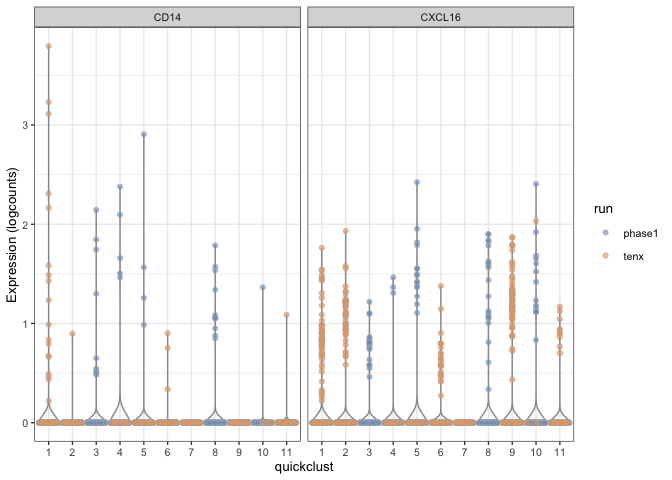

Phase1 / 10X Synovium Integration
================
Andrew McDavid
2022-01-31

``` r
knitr::opts_chunk$set(echo = TRUE, cache=TRUE, autodep=TRUE, message=FALSE, warning=FALSE)
knitr::opts_chunk$set(dev = c('png', 'pdf'))

library(SingleCellExperiment)
```

    ## Loading required package: SummarizedExperiment

    ## Loading required package: GenomicRanges

    ## Loading required package: stats4

    ## Loading required package: BiocGenerics

    ## Loading required package: parallel

    ## 
    ## Attaching package: 'BiocGenerics'

    ## The following objects are masked from 'package:parallel':
    ## 
    ##     clusterApply, clusterApplyLB, clusterCall, clusterEvalQ,
    ##     clusterExport, clusterMap, parApply, parCapply, parLapply,
    ##     parLapplyLB, parRapply, parSapply, parSapplyLB

    ## The following objects are masked from 'package:stats':
    ## 
    ##     IQR, mad, sd, var, xtabs

    ## The following objects are masked from 'package:base':
    ## 
    ##     anyDuplicated, append, as.data.frame, basename, cbind, colnames,
    ##     dirname, do.call, duplicated, eval, evalq, Filter, Find, get, grep,
    ##     grepl, intersect, is.unsorted, lapply, Map, mapply, match, mget,
    ##     order, paste, pmax, pmax.int, pmin, pmin.int, Position, rank,
    ##     rbind, Reduce, rownames, sapply, setdiff, sort, table, tapply,
    ##     union, unique, unsplit, which, which.max, which.min

    ## Loading required package: S4Vectors

    ## 
    ## Attaching package: 'S4Vectors'

    ## The following object is masked from 'package:base':
    ## 
    ##     expand.grid

    ## Loading required package: IRanges

    ## Loading required package: GenomeInfoDb

    ## Loading required package: Biobase

    ## Welcome to Bioconductor
    ## 
    ##     Vignettes contain introductory material; view with
    ##     'browseVignettes()'. To cite Bioconductor, see
    ##     'citation("Biobase")', and for packages 'citation("pkgname")'.

    ## Loading required package: DelayedArray

    ## Loading required package: matrixStats

    ## 
    ## Attaching package: 'matrixStats'

    ## The following objects are masked from 'package:Biobase':
    ## 
    ##     anyMissing, rowMedians

    ## Loading required package: BiocParallel

    ## 
    ## Attaching package: 'DelayedArray'

    ## The following objects are masked from 'package:matrixStats':
    ## 
    ##     colMaxs, colMins, colRanges, rowMaxs, rowMins, rowRanges

    ## The following objects are masked from 'package:base':
    ## 
    ##     aperm, apply, rowsum

``` r
library(readr)
library(dplyr)
```

    ## 
    ## Attaching package: 'dplyr'

    ## The following object is masked from 'package:matrixStats':
    ## 
    ##     count

    ## The following object is masked from 'package:Biobase':
    ## 
    ##     combine

    ## The following objects are masked from 'package:GenomicRanges':
    ## 
    ##     intersect, setdiff, union

    ## The following object is masked from 'package:GenomeInfoDb':
    ## 
    ##     intersect

    ## The following objects are masked from 'package:IRanges':
    ## 
    ##     collapse, desc, intersect, setdiff, slice, union

    ## The following objects are masked from 'package:S4Vectors':
    ## 
    ##     first, intersect, rename, setdiff, setequal, union

    ## The following objects are masked from 'package:BiocGenerics':
    ## 
    ##     combine, intersect, setdiff, union

    ## The following objects are masked from 'package:stats':
    ## 
    ##     filter, lag

    ## The following objects are masked from 'package:base':
    ## 
    ##     intersect, setdiff, setequal, union

``` r
library(stringr)
library(ggplot2)
library(scater)

phase1 = readRDS('private/01_sce_bcell.rds')
phase1_sle = readRDS('private/01_sle_bcell.rds')
tenx = SingleCellExperiment(assay = readRDS('private/filtered_clustered_exprs.rds'),
                                            rowData = read_csv('private/filtered_clustered_fdata.csv'),
                                            colData = read_csv('private/filtered_clustered_cdata.csv'))
```

    ## Parsed with column specification:
    ## cols(
    ##   .default = col_double(),
    ##   dataset = col_character(),
    ##   barcode = col_character(),
    ##   Sample = col_character(),
    ##   Barcode = col_character(),
    ##   sample = col_character(),
    ##   pop = col_character(),
    ##   raw_chain_type = col_character(),
    ##   pairing = col_character(),
    ##   canonical = col_character(),
    ##   chain_type = col_character(),
    ##   class_heavy = col_character(),
    ##   class_light = col_character(),
    ##   cluster_idx.1 = col_character(),
    ##   cluster_idx.2 = col_character(),
    ##   cluster_idx.1_fct = col_character(),
    ##   cluster_idx.2_fct = col_character(),
    ##   large_cluster_id = col_logical(),
    ##   seqgek_bc = col_character(),
    ##   seqgek_qc_ok = col_logical(),
    ##   bad_counts = col_logical()
    ##   # ... with 4 more columns
    ## )

    ## See spec(...) for full column specifications.

    ## Warning: 118 parsing failures.
    ##  row              col           expected         actual                                   file
    ## 2187 large_cluster_id 1/0/T/F/TRUE/FALSE CTTDLEYW       'private/filtered_clustered_cdata.csv'
    ## 2337 large_cluster_id 1/0/T/F/TRUE/FALSE CTTDLEYW       'private/filtered_clustered_cdata.csv'
    ## 2365 large_cluster_id 1/0/T/F/TRUE/FALSE CTTDLEYW       'private/filtered_clustered_cdata.csv'
    ## 2440 large_cluster_id 1/0/T/F/TRUE/FALSE CTTDLEYW       'private/filtered_clustered_cdata.csv'
    ## 2513 large_cluster_id 1/0/T/F/TRUE/FALSE CARHWRGKKPFDSW 'private/filtered_clustered_cdata.csv'
    ## .... ................ .................. .............. ......................................
    ## See problems(...) for more details.

    ## Parsed with column specification:
    ## cols(
    ##   .default = col_double(),
    ##   symbol = col_character(),
    ##   ID = col_character(),
    ##   Symbol = col_character(),
    ##   group = col_character(),
    ##   is_feature_control = col_logical(),
    ##   is_feature_control_mito = col_logical(),
    ##   hvg = col_logical()
    ## )
    ## See spec(...) for full column specifications.

``` r
zheng = DropletUtils::read10xCounts('private/zhen_bcells_filtered_matrices_mex/hg19/')
```

## Day 0

``` r
lazy_cellcall = function(sce_){
  br.out = DropletUtils::barcodeRanks(assay(sce_))
  plot(br.out$rank, br.out$total, log="xy", xlab="Rank", ylab="Total")
o = order(br.out$rank)
lines(br.out$rank[o], br.out$fitted[o], col="red")
abline(h=metadata(br.out)$knee, col="dodgerblue", lty=2)
abline(h=metadata(br.out)$inflection, col="forestgreen", lty=2)
legend("bottomleft", lty=2, col=c("dodgerblue", "forestgreen"), 
    legend=c("knee", "inflection"))
  br.out
}

call_intercalate = function(f, ..., extra){
  do.call(f, c(list(...), extra))
}

halfbaked_qc = function(sce_, br.out, perCellQCArgs = list(percent_subsets = c('subsets_Mito_percent', 'percent_top_50'))) {
  ncell_start = ncol(sce_)
  is.mito = str_detect(rowData(sce_)$Symbol, '^MT-')
  df = perCellQCMetrics(sce_, subsets=list(Mito=is.mito))
  qqc = call_intercalate(quickPerCellQC, df, extra = perCellQCArgs)
  colData(sce_) = cbind(colData(sce_), df, qqc)
  
  qcplot = ggplot(colData(sce_) %>% as.data.frame(), aes(x = discard, y = sum)) + geom_boxplot() 
  print(qcplot + scale_y_log10())
  print(qcplot + aes(y = detected) + scale_y_log10())
  print(qcplot + aes(y = subsets_Mito_percent))
  print(qcplot + aes(y = percent_top_50))
  
  if(!missing(br.out)){
    empty = br.out$total < metadata(br.out)$knee
    sce_ = sce_[,!empty & !qqc$discard]
  } else{
    empty = rep(FALSE, ncol(sce_))
    sce_ = sce_[,!qqc$discard]
  }
  qc_table = data.frame(condition = c('start', 'empty', 'qc_fail', 'end'), ncells = c(ncell_start, sum(empty), sum(qqc$discard), ncol(sce_)))
  sce_ = logNormCounts(sce_)
  metadata(colData(sce_)) = list(qc = qc_table)
  sce_
}
```

# Combine data

``` r
# Disable log file cluttering 
futile.logger::flog.threshold(futile.logger::ERROR, name = "VennDiagramLogger")
```

    ## NULL

``` r
vd = VennDiagram::venn.diagram(list(phase1_ra = rownames(phase1), 
                                    tenx = rownames(tenx), 
                                    phase1_sle = rownames(phase1_sle),
                                    zheng = rowData(zheng)$Symbol),
                                    filename = NULL, fill = c('red', 'yellow', 'blue', 'grey50'), alpha = rep(.35, 4))
grid::grid.draw(vd)
```

<!-- -->

``` r
common_id = purrr::reduce(list(rownames(phase1), rownames(tenx), rownames(phase1_sle), rowData(zheng)$Symbol), intersect)
```

``` r
phase1_inter = phase1[common_id,]
tenx_inter = tenx[common_id,]
cd_phase1_inter = colData(phase1_inter) %>% as.data.frame() %>% select(Barcode = cell_name, orig_bc = barcode, sample, type, cluster, disease) %>% mutate(run = 'phase1')

cd_tenx_inter = colData(tenx_inter) %>% as.data.frame() %>% select(subject = sample, sample = dataset, Barcode, chain_type,  class_heavy, class_light, shm_rate, res.0.5, ident) %>% mutate(cluster = str_c('TX', res.0.5), Barcode = make.unique(Barcode), run = 'tenx')

rd_phase1_inter = rowData(phase1_inter) %>% as.data.frame() %>% select(symbol, group)
rd_phase1_tenx =  rowData(tenx_inter) %>% as.data.frame() %>% select(symbol = Symbol)

coldat_inter = bind_rows(cd_phase1_inter, cd_tenx_inter)
rd_inter = left_join(rd_phase1_inter, rd_phase1_tenx)

sce = SingleCellExperiment(assay = cbind(Matrix::Matrix(counts(phase1_inter), sparse = TRUE), assay(tenx_inter)),
                           rowData = rd_inter, colData = coldat_inter)
colnames(sce) = sce$Barcode
assayNames(sce) = 'counts'
blacklist = str_detect(rowData(sce)$symbol, 'IG[HKL]V[0-9]+')
blacklist_name = rowData(sce)$symbol[blacklist]
```

## Zheng QC

``` r
br.out = lazy_cellcall(zheng)
```

<!-- -->

``` r
zheng = halfbaked_qc(zheng, br.out)
```

<!-- --><!-- --><!-- --><!-- -->

``` r
knitr::kable(metadata(colData(zheng))$qc)
```

| condition | ncells |
|:----------|-------:|
| start     |  10085 |
| empty     |   2485 |
| qc\_fail  |    368 |
| end       |   7492 |

``` r
zheng = zheng[!duplicated(rowData(zheng)$Symbol),]
rownames(zheng) = rowData(zheng)$Symbol
plotExpression(zheng, x = 'MS4A1', features = c('CD3E', 'CD14', 'CD19', 'XBP1', 'TCL1A', 'HOPX'))
```

<!-- -->

No expression of CD3 or CD14, otherwise seems reasonable?

## Joint QC

``` r
sce = halfbaked_qc(sce, perCellQCArgs = list(percent_subsets = NULL, batch = factor(sce$run)))
```

<!-- --><!-- --><!-- --><!-- -->

``` r
knitr::kable(metadata(colData(sce))$qc)
```

| condition | ncells |
|:----------|-------:|
| start     |   5769 |
| empty     |      0 |
| qc\_fail  |    506 |
| end       |   5263 |

``` r
saveRDS(sce, file = 'refined/amp_sle_ra_sce.rds')
```

``` r
sce$quickclust = scran::quickCluster(sce)
plotExpression(sce, x = "PDPN", features = c("FN1", 'COL3A1'), colour_by = "run", exprs_values = 'logcounts')
```

<!-- -->

``` r
plotExpression(sce, x = 'CD14', features = 'CXCL16', colour_by = 'quickclust')
```

<!-- -->

``` r
plotExpression(sce, x = 'quickclust', features = c('CD14', 'CXCL16'), colour_by = 'run')
```

<!-- -->

# SLE Phase 1

``` r
phase1_sle = logNormCounts(phase1_sle)

ggplot(as.data.frame(colData(phase1_sle)), aes(x = sample, fill = cluster)) + geom_bar() + coord_flip()
```

<!-- -->

# SingleR

## Train on 10x, predict on AMP and Zheng

``` r
ref = sce[,sce$run == 'tenx' & !is.na(sce$ident)]

train = SingleR::trainSingleR(ref = ref, labels = ref$ident, de.method = "classic")
phase1 = sce[,sce$run == 'phase1']

pred_tenx = SingleR::classifySingleR(ref, train)
pred_phase1 = SingleR::classifySingleR(phase1, train)
pred_sle = SingleR::classifySingleR(phase1_sle, train)
pred_zheng = SingleR::classifySingleR(zheng, train)
```

``` r
merge.SingleCellExperiment = function(x, y, ...){
    nx = x
   rd = getS3method('merge', class(rowData(x)))(x, y, ...)
   cd = colData(x)
}
```

## Classifying our 10x data

``` r
SingleR::plotScoreHeatmap(pred_tenx, clusters = ref$ident, show.labels = FALSE)
```

<!-- -->

## Classifying phase 1

``` r
SingleR::plotScoreHeatmap(pred_phase1, clusters = phase1$cluster)
```

<!-- -->

``` r
SingleR::plotScoreDistribution(pred_phase1, show = "delta.med", show.nmads = 3)
```

<!-- -->

Shows scores of classified vs non-classified cells. Horizontal line is
the lines for rejecting any classification.

## Classifying SLE phase1

``` r
SingleR::plotScoreHeatmap(pred_sle, clusters = phase1_sle$cluster)
```

<!-- -->

``` r
SingleR::plotScoreDistribution(pred_sle, show = "delta.med", show.nmads = 3)
```

<!-- -->

``` r
pred_phase1_sle_df = cbind(pred_sle, colData(phase1_sle))

ggplot(as.data.frame(pred_phase1_sle_df), aes(x = sample, fill = pruned.labels)) + 
  geom_bar() + coord_flip()
```

<!-- -->

## Classifying Zheng CD19 B

``` r
SingleR::plotScoreHeatmap(pred_zheng)
```

<!-- -->

``` r
SingleR::plotScoreDistribution(pred_zheng, show = "delta.med", show.nmads = 3)
```

<!-- -->

``` r
pred_zhang_df = cbind(pred_zheng, colData(zheng), sample = 'Zheng PBMC', cluster = 'CD19+ B')
```

``` r
pred_phase1_df = cbind(pred_phase1, colData(phase1))

sample_prop = as.data.frame(pred_phase1_df) %>% group_by(pruned.labels, sample, disease) %>% 
  summarize(n_cluster = n()) %>% group_by(sample, disease) %>% mutate(n_overall = sum(n_cluster),
                                                                      prop = n_cluster/n_overall)


crosstab = as.data.frame(xtabs(~pruned.labels + cluster + sample, data = as.data.frame(pred_phase1_df), addNA = TRUE))

crosstab2 = as.data.frame(xtabs(Freq ~sample, data = crosstab)) %>% rename(total = Freq)
crosstab = left_join(crosstab, crosstab2) %>% mutate(prop = Freq/total)


#crosstab = as.data.frame(pred_phase1b) %>% group_by(pruned.labels, cluster, sample, disease) %>% 
#  summarize(n_cluster = n()) %>% group_by(sample, disease) %>% mutate(n_overall = sum(n_cluster),
#                                                                      prop = n_cluster/n_overall) %>% #tidyr::complete(pruned.labels, cluster, tidyr::nesting(sample, disease), fill = list(prop = 0))

ggplot(crosstab, aes(x = cluster, y = pruned.labels, fill = prop)) + geom_tile() +
  facet_wrap(~sample) + scale_fill_distiller()
```

<!-- -->

``` r
ggplot(sample_prop, aes(x = pruned.labels, y = prop)) + geom_boxplot()
```

<!-- -->

``` r
ggplot(sample_prop, aes(x = sample, fill = pruned.labels, y = prop)) + 
  geom_col() + coord_flip()
```

<!-- -->

``` r
pred_tenx = cbind(pred_tenx, colData(ref))
all_df = list(synovium = pred_tenx[, c('scores', 'pruned.labels', 'cluster', 'sample')],
  amp_sle = pred_phase1_sle_df[, c('scores', 'pruned.labels', 'cluster', 'sample')], 
                 amp_ra = pred_phase1_df[, c('scores', 'pruned.labels', 'cluster', 'sample')],
              peripheral_b = pred_zhang_df[, c('scores', 'pruned.labels', 'cluster', 'sample')]
  )

all_pred = purrr::map_dfr(all_df, as.data.frame, .id = 'experiment')

all_pred = mutate(all_pred, experiment = ifelse(sample == 'RA134_BLD', 'peripheral_b', experiment))

sample_exp_tab = unique(select(all_pred, experiment, sample)) %>%
  mutate(Experiment = factor(experiment, levels = c('amp_sle', 'peripheral_b','amp_ra', 'synovium'), labels = c('SLE (AMP)',  'Peripheral B', 'Synovium (AMP)', 'Synovium (10x)')))

score_plot = ggplot(all_pred, aes(x = cluster, y = scores.NR4A.))  + 
  facet_grid(~experiment, space = 'free_x', scales = 'free_x') + ylab('Spearman Correlation NR4A+')

score_plot + ggbeeswarm::geom_quasirandom()
```

<!-- -->

``` r
score_plot + geom_boxplot()
```

<!-- -->

``` r
score_plot + aes(y = scores.Plasma.i.) + geom_boxplot()
```

<!-- -->

``` r
score_plot + aes(x = pruned.labels) + geom_boxplot()
```

<!-- -->

``` r
ggplot(all_pred, aes(x = sample, fill = pruned.labels)) + geom_bar() + 
  facet_wrap(~experiment, scales = 'free') + coord_flip()
```

<!-- -->

``` r
summary(lm(scores.NR4A. ~ experiment, data = filter(all_pred, pruned.labels == 'NR4A+')))
```

    ## 
    ## Call:
    ## lm(formula = scores.NR4A. ~ experiment, data = filter(all_pred, 
    ##     pruned.labels == "NR4A+"))
    ## 
    ## Residuals:
    ##       Min        1Q    Median        3Q       Max 
    ## -0.281859 -0.013308  0.003596  0.019437  0.091046 
    ## 
    ## Coefficients:
    ##                         Estimate Std. Error t value Pr(>|t|)    
    ## (Intercept)             0.411514   0.001214 339.008   <2e-16 ***
    ## experimentamp_sle      -0.015323   0.010348  -1.481    0.139    
    ## experimentperipheral_b  0.093168   0.002183  42.681   <2e-16 ***
    ## experimentsynovium      0.187060   0.001786 104.724   <2e-16 ***
    ## ---
    ## Signif. codes:  0 '***' 0.001 '**' 0.01 '*' 0.05 '.' 0.1 ' ' 1
    ## 
    ## Residual standard error: 0.0356 on 1991 degrees of freedom
    ## Multiple R-squared:  0.8477, Adjusted R-squared:  0.8474 
    ## F-statistic:  3693 on 3 and 1991 DF,  p-value: < 2.2e-16

Compare 28 NRA41+ cells in SLE to 835 cells in RA. Maybe also compare
the gap between first and second or first and third (since second is
likely LMNA+) best cluster?

``` r
subpop_mixedmodel = function(population) {
  sample_tab = table(sample = all_pred$sample, 'subpop' = all_pred$pruned.labels== population)
  
  knitr::kable(sample_tab)
  
  sample_tab = sample_tab[rowSums(sample_tab) >= 5,]
  
  sample_tib = as_tibble(unclass(sample_tab), rownames = 'sample') %>% left_join(sample_exp_tab)
  
  subpop_lme = lme4::glmer(cbind(`TRUE`, `FALSE`) ~ experiment + (1|sample), family = 'binomial', data = sample_tib)
  exp_tab = data.frame(experiment = unique(sample_tib$experiment, sample = NA))
  
  bs = lme4::bootMer(subpop_lme, nsim = 100, re.form = NA, FUN = function(m) predict(m, newdata =exp_tab , re.form = NA, type = 'response'))
  
  subpop_fitted = cbind(estimate = bs$t0, exp_tab, confint(bs)) %>% right_join(unique(sample_exp_tab[c('experiment', 'Experiment')]))
  
  
  subpop_tab = as.data.frame(prop.table(sample_tab, margin = 1)) %>% left_join(sample_exp_tab) %>% filter(subpop == TRUE)
  
  plt = ggplot(subpop_tab, aes(x = Experiment, y = Freq)) + ggbeeswarm::geom_beeswarm() + geom_crossbar(data = subpop_fitted, aes(y = estimate, ymin = `2.5 %`, ymax = `97.5 %`), color = 'blue', width = .1) + theme_minimal() + ylab(sprintf("%s Frequency", population))
  print(plt)
  invisible(list(lme = subpop_lme, ggplot = plt, sample_tib = sample_tib))
}
```

``` r
nr4_lme = subpop_mixedmodel("NR4A+")
```

<!-- -->

``` r
nr4a_tib = nr4_lme$sample_tib
summary(nr4_lme$lme)
```

    ## Generalized linear mixed model fit by maximum likelihood (Laplace
    ##   Approximation) [glmerMod]
    ##  Family: binomial  ( logit )
    ## Formula: cbind(`TRUE`, `FALSE`) ~ experiment + (1 | sample)
    ##    Data: sample_tib
    ## 
    ##      AIC      BIC   logLik deviance df.resid 
    ##    238.6    246.1   -114.3    228.6       28 
    ## 
    ## Scaled residuals: 
    ##      Min       1Q   Median       3Q      Max 
    ## -1.22185 -0.33552 -0.04511  0.18935  0.65156 
    ## 
    ## Random effects:
    ##  Groups Name        Variance Std.Dev.
    ##  sample (Intercept) 1.262    1.124   
    ## Number of obs: 33, groups:  sample, 33
    ## 
    ## Fixed effects:
    ##                        Estimate Std. Error z value Pr(>|z|)    
    ## (Intercept)            -0.04478    0.30603  -0.146    0.884    
    ## experimentamp_sle      -4.07865    0.59468  -6.859 6.96e-12 ***
    ## experimentperipheral_b -4.90174    0.94223  -5.202 1.97e-07 ***
    ## experimentsynovium     -0.39642    0.64205  -0.617    0.537    
    ## ---
    ## Signif. codes:  0 '***' 0.001 '**' 0.01 '*' 0.05 '.' 0.1 ' ' 1
    ## 
    ## Correlation of Fixed Effects:
    ##             (Intr) exprmntm_ exprmntp_
    ## exprmntmp_s -0.514                    
    ## exprmntprp_ -0.324  0.196             
    ## exprmntsynv -0.477  0.245     0.154

### LMNA frequencies

``` r
lmna_lme = subpop_mixedmodel("LMNA+")
```

<!-- -->

``` r
summary(lmna_lme$lme)
```

    ## Generalized linear mixed model fit by maximum likelihood (Laplace
    ##   Approximation) [glmerMod]
    ##  Family: binomial  ( logit )
    ## Formula: cbind(`TRUE`, `FALSE`) ~ experiment + (1 | sample)
    ##    Data: sample_tib
    ## 
    ##      AIC      BIC   logLik deviance df.resid 
    ##    208.2    215.7    -99.1    198.2       28 
    ## 
    ## Scaled residuals: 
    ##     Min      1Q  Median      3Q     Max 
    ## -1.2620 -0.4255 -0.0134  0.1437  1.5317 
    ## 
    ## Random effects:
    ##  Groups Name        Variance Std.Dev.
    ##  sample (Intercept) 1.208    1.099   
    ## Number of obs: 33, groups:  sample, 33
    ## 
    ## Fixed effects:
    ##                        Estimate Std. Error z value Pr(>|z|)    
    ## (Intercept)             -2.6109     0.3130  -8.342   <2e-16 ***
    ## experimentamp_sle       -1.4500     0.5893  -2.461   0.0139 *  
    ## experimentperipheral_b  -2.2313     0.9257  -2.410   0.0159 *  
    ## experimentsynovium       1.3967     0.6362   2.195   0.0281 *  
    ## ---
    ## Signif. codes:  0 '***' 0.001 '**' 0.01 '*' 0.05 '.' 0.1 ' ' 1
    ## 
    ## Correlation of Fixed Effects:
    ##             (Intr) exprmntm_ exprmntp_
    ## exprmntmp_s -0.523                    
    ## exprmntprp_ -0.328  0.200             
    ## exprmntsynv -0.492  0.258     0.163

# Correlate AMP-1 with singleR labels

``` r
cluster_id = readRDS('private/celseq_synovium_meta_5265cells_paper.rds')

cluster_freq = cluster_id %>% group_by(cell_type) %>% do({
  cluster = factor(.$cluster)
  sample = factor(.$sample)
  tab = table(cluster, sample)
  as.data.frame(tab)
}) %>% group_by(cell_type, sample) %>% mutate(total = sum(Freq), percent = Freq/total*100)

phase1_join = inner_join(nr4a_tib, cluster_freq) 
```

``` r
#sce_t = readRDS('01_sce_tcell.rds')

#t_pop = colData(sce_t) %>% as.data.frame() %>% filter(!is.na(cluster))

# count_pops = . %>% group_by(sample, disease, cluster) %>% summarize(n()) %>% tidyr::complete(cluster, tidyr::nesting(sample, disease), fill = list(`n()` =0)) %>%
#   group_by(sample, disease) %>% mutate(total = sum(`n()`), prop = `n()`/total) 
# 
# t_pop = t_pop %>% count_pops 
# 
# b_pop = md %>% count_pops
# 
# both_pop = inner_join(t_pop, b_pop, by = c('sample', 'disease'), suffix = c('_t', '_b'))

pop_tests = phase1_join %>% group_by(cluster) %>% do({
  dat = .
  gg = lme4::glmer(cbind(`TRUE`, `FALSE`) ~ percent+ (1|sample),  data = dat, family= 'binomial')
  broom::tidy(gg, conf.int = TRUE)
})

ptests = filter(pop_tests, term == 'percent') %>% ungroup() %>% mutate(fdr = p.adjust(p.value)) %>% select(-term) %>% rename(term = cluster)

dotwhisker::dwplot(ptests) + geom_text(aes(x = estimate, y = term, label = ifelse(fdr < .01, '<.01', round(fdr, 2))), position = position_nudge(y = .2, x = .04)) + ylab("Phase 1 cluster") + xlab("Log odds of NR4A+\n per % phase 1")
```

<!-- -->

``` r
knitr::kable(ptests)
```

| term  |   estimate | std.error |  statistic |   p.value |   conf.low |  conf.high | group |       fdr |
|:------|-----------:|----------:|-----------:|----------:|-----------:|-----------:|:------|----------:|
| SC-B1 |  0.0399432 | 0.0090875 |  4.3953875 | 0.0000111 |  0.0221320 |  0.0577545 | fixed | 0.0001880 |
| SC-B2 |  0.0290744 | 0.0180031 |  1.6149714 | 0.1063169 | -0.0062109 |  0.0643598 | fixed | 1.0000000 |
| SC-B3 | -0.0366786 | 0.0237117 | -1.5468548 | 0.1218983 | -0.0831527 |  0.0097955 | fixed | 1.0000000 |
| SC-B4 | -0.0434869 | 0.0079923 | -5.4411201 | 0.0000001 | -0.0591515 | -0.0278224 | fixed | 0.0000010 |
| SC-F1 |  0.0062029 | 0.0089085 |  0.6962915 | 0.4862463 | -0.0112575 |  0.0236633 | fixed | 1.0000000 |
| SC-F2 | -0.0098004 | 0.0061323 | -1.5981557 | 0.1100083 | -0.0218196 |  0.0022187 | fixed | 1.0000000 |
| SC-F3 |  0.0306404 | 0.0172372 |  1.7775701 | 0.0754745 | -0.0031440 |  0.0644248 | fixed | 1.0000000 |
| SC-F4 |  0.0135088 | 0.0156158 |  0.8650702 | 0.3870002 | -0.0170977 |  0.0441153 | fixed | 1.0000000 |
| SC-M1 |  0.0018791 | 0.0099043 |  0.1897221 | 0.8495269 | -0.0175331 |  0.0212912 | fixed | 1.0000000 |
| SC-M2 |  0.0133554 | 0.0084522 |  1.5801054 | 0.1140827 | -0.0032106 |  0.0299214 | fixed | 1.0000000 |
| SC-M3 | -0.0260874 | 0.0137688 | -1.8946790 | 0.0581349 | -0.0530737 |  0.0008989 | fixed | 0.8720240 |
| SC-M4 | -0.0101335 | 0.0117337 | -0.8636233 | 0.3877948 | -0.0331312 |  0.0128641 | fixed | 1.0000000 |
| SC-T1 |  0.0178724 | 0.0102343 |  1.7463258 | 0.0807543 | -0.0021864 |  0.0379312 | fixed | 1.0000000 |
| SC-T2 | -0.0935038 | 0.0688114 | -1.3588417 | 0.1741968 | -0.2283716 |  0.0413641 | fixed | 1.0000000 |
| SC-T3 | -0.1082352 | 0.0413697 | -2.6162880 | 0.0088892 | -0.1893183 | -0.0271520 | fixed | 0.1422265 |
| SC-T4 | -0.0079585 | 0.0130153 | -0.6114769 | 0.5408839 | -0.0334680 |  0.0175509 | fixed | 1.0000000 |
| SC-T5 | -0.0430366 | 0.0301544 | -1.4272113 | 0.1535190 | -0.1021381 |  0.0160648 | fixed | 1.0000000 |
| SC-T6 |  0.0039942 | 0.0235052 |  0.1699275 | 0.8650672 | -0.0420751 |  0.0500634 | fixed | 1.0000000 |
