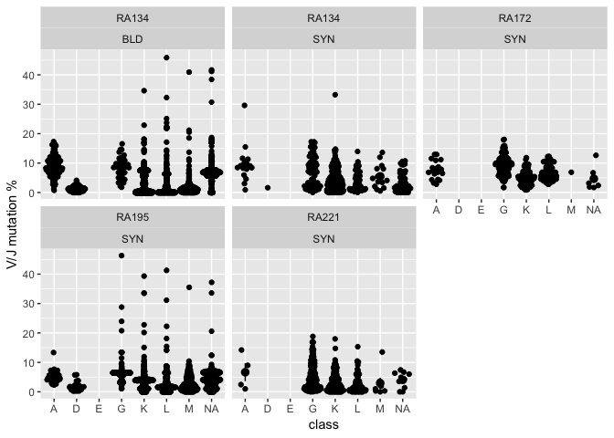

Exploring the pipestance contig annotations
================
Andrew McDavid
2022-02-07

# Load libraries

``` r
knitr::opts_chunk$set(echo = TRUE, cache=TRUE, autodep=TRUE, message=FALSE, warning=FALSE)
library(broom)
library(tidyverse)
library(GGally)
library(ggbeeswarm)
clamp = function(x, modulus = 5) {
    x[x < -modulus] = -modulus
    x[x > modulus] = modulus
    x
}
```

# Load contig files

``` r
files = list.files('data/deliv_Anolik_042318_cellRangerVDJ/', pattern = "all_contig_annotations.csv", recursive = TRUE, full.names = TRUE)

vquest = list.files('data/deliv_Anolik_042318_cellRangerVDJ/', pattern = "*_db-pass.tab", recursive = TRUE, full.names = TRUE)

# Pull out sample and population names
samp_map = data_frame(anno_file = files, vquest = vquest, sample = str_match(files, '//Sample_(RA[0-9]+)')[,2], pop = str_match(files, '(Syn|SYN|BLD)')[,1] %>% toupper())
# read in CSV
all_anno = samp_map %>% rowwise() %>% mutate(anno = list(read_csv(anno_file))) %>% unnest() %>% 
    # write a column specifying what cell type we found
    mutate(celltype = case_when(chain %in% c('TRA', 'TRB', 'TRD', 'TRG') ~ "T", chain == 'Multi' ~ 'Multi', chain %in% c('IGH','IGK', 'IGL') ~ 'B', TRUE ~ NA_character_))

all_anno = all_anno %>% mutate(ig_heavy = str_detect(c_gene, 'IGH.+'),
                               class = str_match(c_gene, 'IG[H]?(A|D|E|G|M|K|L)[C0-9]*')[,2])
# Note that sometimes we have a full-length, "productive" BCR but no C gene recovered!
```

Combine runs and decide if the contig is a T/B cell or chimeric.

# SHM and CDR3 features by contig class

``` r
all_vq = samp_map %>% rowwise() %>% mutate(vq = list(read_tsv(vquest))) %>% unnest() %>% dplyr::rename(contig_id = SEQUENCE_ID)
names(all_vq) = tolower(names(all_vq))
vq_anno = left_join(all_anno, all_vq %>% select(sample:contig_id, functional:j_call, v_seq_start:j_identity), by = c('sample', 'pop', 'contig_id'))

all_anno = vq_anno %>% mutate(vshm = (1-v_identity)*v_germ_length_imgt, jshm = (1-j_identity)*j_germ_length, shm = vshm + jshm, len_without_d = v_germ_length_imgt + j_germ_length)

mut_plot = ggplot(all_anno, aes(y = shm/len_without_d * 100, x = class)) + geom_quasirandom() + stat_summary() + facet_wrap(~sample + pop)


mut_plot + ylab("V/J mutation %") 
```

<!-- -->

``` r
mut_plot + aes(y = str_length(cdr3_nt))
```

<!-- -->

``` r
mut_plot + aes(y = shm)
```

<!-- -->

``` r
with(vq_anno, table(productive, functional, full_length, exclude = NULL))
```

    ## , , full_length = False
    ## 
    ##           functional
    ## productive FALSE  TRUE  <NA>
    ##      False    17     1    13
    ##      None    132  1602 13779
    ##      True      0     0     0
    ## 
    ## , , full_length = True
    ## 
    ##           functional
    ## productive FALSE  TRUE  <NA>
    ##      False   204    45    12
    ##      None    128    71    41
    ##      True      5  6535     7

``` r
vq_anno %>% group_by(v_gene, v_call, full_length) %>% summarize(n())
```

    ## # A tibble: 734 x 4
    ## # Groups:   v_gene, v_call [?]
    ##    v_gene   v_call                                       full_length `n()`
    ##    <chr>    <chr>                                        <chr>       <int>
    ##  1 IGHV1-18 Homsap IGHV1-18*01 F                         False          36
    ##  2 IGHV1-18 Homsap IGHV1-18*01 F                         True          331
    ##  3 IGHV1-18 Homsap IGHV1-18*01 F,Homsap IGHV1-18*04 F    False          16
    ##  4 IGHV1-18 Homsap IGHV1-18*04 F                         False           9
    ##  5 IGHV1-18 Homsap IGHV1-18*04 F                         True           11
    ##  6 IGHV1-18 Homsap IGHV1-58*01 F,Homsap IGHV1-58*02 F,H… False           1
    ##  7 IGHV1-18 <NA>                                         False         436
    ##  8 IGHV1-18 <NA>                                         True            1
    ##  9 IGHV1-2  Homsap IGHV1-2*02 F                          False           4
    ## 10 IGHV1-2  Homsap IGHV1-2*02 F                          True           90
    ## # ... with 724 more rows

``` r
ggplot(filter(all_anno, class %in% c('A', 'D', 'G', 'M'), sample == 'RA134', productive == 'True'), aes(y = shm/len_without_d * 100, x = pop)) + geom_quasirandom(aes(color = pop)) + facet_grid( ~ class) + theme_minimal(base_size = 14) + ylab("V/J mutation %")  + xlab('') + theme(legend.pos = 'top') + stat_summary()
```

<!-- -->

# SHM in heavy vs light

``` r
heavy = filter(all_anno, class %in% c('A', 'D', 'G', 'M'), productive == 'True') %>% group_by(sample, pop, barcode) %>% summarize(shm_rate = mean(shm/len_without_d, na.rm = TRUE), class = class[1])

light = filter(all_anno, !(class %in% c('A', 'D', 'G', 'M')), productive == 'True')  %>% group_by(sample, pop, barcode) %>% summarize(shm_rate = mean(shm/len_without_d, na.rm = TRUE), class = class[1])

join = full_join(heavy, light, by = c('sample', 'pop', 'barcode'), suffix = c('_heavy', '_light'))

ggplot(join, aes(x = shm_rate_heavy, y = shm_rate_light)) + geom_point(aes(color = sample)) + geom_smooth(method = 'lm') + facet_grid(~class_light ~ class_heavy, scales = 'free')
```

<!-- -->

# UMIs vs reads

``` r
MIN_READS = 30

filter(all_anno, is_cell == 'True') %>% mutate(reads = clamp(reads, 2000), umis = clamp(umis, 32)) %>% mutate(umi_cat = cut(umis, breaks = c(0, 1, 2, 4, 8, 16, 32)), type = case_when( (celltype == 'B') & productive == 'True' ~ 'productive B' , celltype == 'B' ~ 'unproductive B',  TRUE ~ 'other')) %>% ggplot(aes(x = reads, y = umi_cat)) + geom_quasirandom(size = 1, alpha = .5, groupOnX = FALSE) + facet_wrap(~type) + scale_x_log10() + geom_vline(xintercept = MIN_READS, lty = 2)
```

<!-- -->

# High confidence UMIs belonging to B cells per cell

``` r
MIN_UMI = 3

total_umi = all_anno  %>% group_by(sample, pop, barcode, is_cell, high_confidence, celltype) %>% summarize(total_umi = sum(umis))

plt = ggplot(filter(total_umi, high_confidence == 'True', celltype == 'B'), aes(lty = factor(is_cell), x = total_umi, color = interaction(sample, pop), label = str_c(sample, pop))) + stat_ecdf() +  coord_cartesian(xlim = c(0, 10)) + ylab('Fraction of barcodes') + geom_vline(xintercept = MIN_UMI, lty = 2) + theme_minimal()


plt
```

<!-- -->

Before contig filter

``` r
total_umi = all_anno %>% group_by(sample, pop, barcode, is_cell, high_confidence, celltype) %>% summarize(total_umi = sum(umis * (reads > MIN_READS)))

plt %+% total_umi
```

<!-- -->

After contig filter

# Properties of B cell contigs

``` r
bcell_bc = total_umi %>% ungroup() %>% spread(celltype, total_umi) %>% mutate(Bratio = B/(B+T))
ggplot(filter(bcell_bc, is_cell == 'True', high_confidence == 'True'), aes(x = T, y = B)) + geom_hex() + facet_wrap(~sample + pop)
```

``` r
knitr::kable(filter(all_anno, celltype == 'T', full_length == 'True') %>% select(sample, pop, chain:full_length, reads, umis))
```

sample pop chain v\_gene d\_gene j\_gene c\_gene full\_length reads umis
——- —- —— ——- ——- ——- ——- ———— —— —–

``` r
knitr::kable(filter(all_anno, celltype == 'T', productive == 'True') %>% select(sample, pop, chain:full_length, reads, umis))
```

sample pop chain v\_gene d\_gene j\_gene c\_gene full\_length reads umis
——- —- —— ——- ——- ——- ——- ———— —— —–

No full\_length or productive T cells.

# Apply B-cell contig UMI filter

``` r
# At least 4 UMI mapping to high confidence T cell contigs.
good_bc = total_umi %>% ungroup() %>% filter(is_cell == 'True') %>% filter(total_umi >= MIN_UMI, celltype == 'B') %>% filter(high_confidence == 'True')
total_cells = good_bc %>% group_by(sample, pop) %>% summarize(good_bc = n())
knitr::kable(total_cells)
```

| sample | pop | good\_bc |
|:-------|:----|---------:|
| RA134  | BLD |     1356 |
| RA134  | SYN |      315 |
| RA172  | SYN |      157 |
| RA195  | SYN |      868 |
| RA221  | SYN |      236 |

# “Multi-class” B cells

``` r
good_anno = semi_join(all_anno, good_bc %>% select(sample, pop, barcode)) %>% filter( high_confidence == 'True', celltype == 'B', reads > MIN_READS)

good_anno %>% mutate(reads = clamp(reads, 2000), umis = clamp(umis, 20)) %>% mutate(umi_cat = cut(umis, 4)) %>% ggplot(aes(y = reads, x = umi_cat)) + geom_quasirandom(size = 1, alpha = .5, groupOnX = TRUE) + facet_wrap(~celltype + productive) + scale_y_log10() + geom_hline(yintercept = MIN_READS, lty = 2)
```

<!-- -->

``` r
n_productive = good_anno  %>% group_by(sample, pop, barcode) %>% summarize(n_productive = n())

multi_productive = right_join(good_anno, filter(n_productive, n_productive > 1)) %>% filter(productive == 'True', high_confidence == 'True')
nchain_barcode = multi_productive %>% group_by(barcode, sample, pop, chain) %>% summarize(`contig per cell` = n())
ggplot(nchain_barcode, aes(x = factor(`contig per cell`), fill = chain)) + geom_bar(position = position_stack()) + facet_wrap(~sample + pop, scales = 'free_y') + theme_minimal() 
```

<!-- -->

A small fraction of cells have multiple copies of productive IGH or
IGK/IGL chains.

# Write good, combined barcodes.

``` r
write_csv(good_anno, 'refined/good_barcodes_combined.csv')
```
