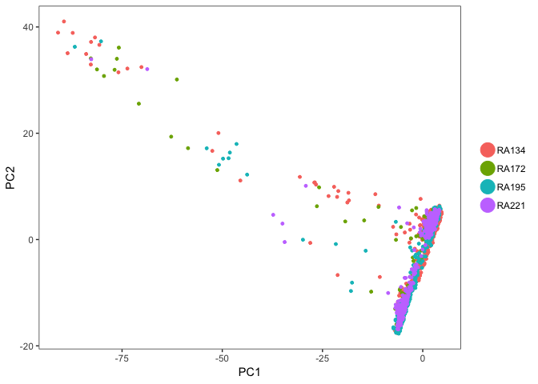
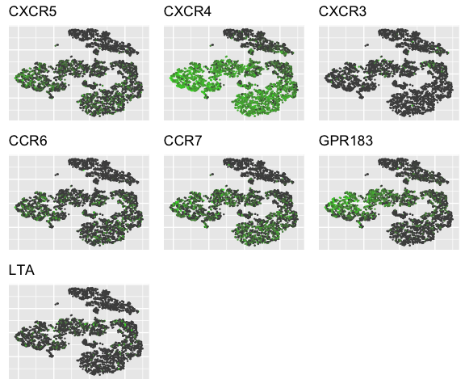
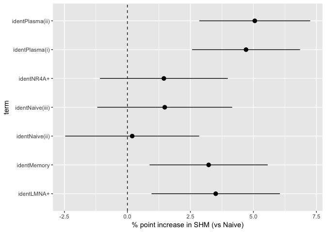
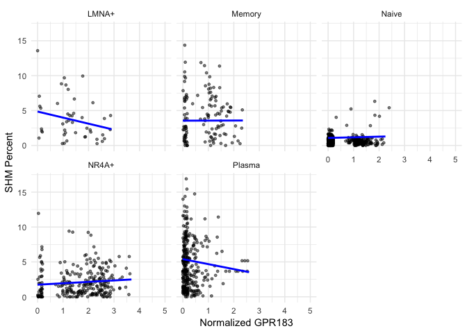
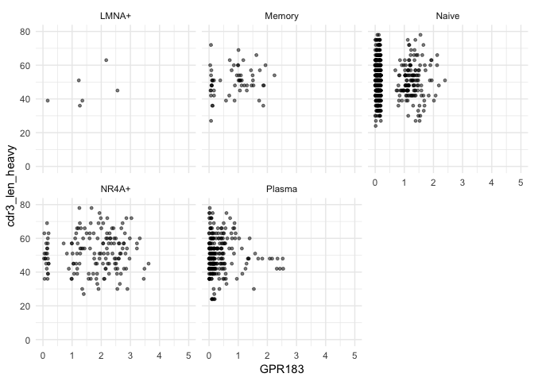

RA Synovial/Blood 5’ expression
================
Andrew McDavid
2022-01-30

# Libraries

``` r
knitr::opts_chunk$set(echo = TRUE, cache=TRUE, autodep=TRUE, message=FALSE, warning=FALSE)
knitr::opts_chunk$set(dev = c('png', 'pdf'))
library(broom)
library(ggbeeswarm)

library(SingleCellExperiment)
library(scater)
library(tidyverse)
library(dplyr)
library(ggrepel)
library(eulerr)
VDJ = TRUE

clamp = function(x, modulus = 5) {
    x[x < -modulus] = -modulus
    x[x > modulus] = modulus
    x
}
```

# Load data

``` r
pipestance_all = list.files('data/deliv_Anolik_042318_cellRanger_only_filtered/', full.names = TRUE, recursive = TRUE, pattern = 'genes.tsv') %>% str_split('/+', simplify = TRUE)

bases = pipestance_all[,3]
pipestance = apply(pipestance_all[,-7], 1, function(x) do.call(file.path, as.list(x)))

samp_map = data_frame(anno_file = pipestance, sample = str_match(bases, 'Sample_(RA[0-9]+)')[,2], pop = str_match(bases, '(Syn|SYN|BLD)')[,1] %>% toupper(), fileset = seq_along(pipestance), dataset = paste(sample, pop, sep = "_"))
names(pipestance) = samp_map$dataset
```

``` r
#these are also in alphabetical order, per Nida

barcodes = read_csv('refined/nida_livecells_barcodes.csv', skip = 5) %>% mutate(barcode = str_replace_all(CellId, '[0-9]_', ''), fileset = as.integer(str_extract(CellId, '^[0-9]'))) %>% left_join(samp_map)
```

## Mapping statistics

``` r
stats = list.files('data/deliv_Anolik_042318_cellRanger_only_filtered/', pattern = 'metrics_summary.csv', full.names = TRUE, recursive = TRUE) 
stats = data_frame(file = stats) %>% rowwise() %>% mutate(stats = list(read_csv(file)))%>% unnest(stats) %>% select(run = file, 'Percent Mapping to Genome' = `Reads Mapped Confidently to Genome`, 'Percent Mapping to Transcriptome' = `Reads Mapped Confidently to Transcriptome`)

write_csv(stats, path = 'refined/10x_statistics.csv')
```

``` r
paired_table = read_csv('refined/expanded_clones.csv')
```

``` r
MIN_EXP_FREQ = .003

all_res = DropletUtils::read10xCounts(samples = unname(pipestance))
colData(all_res)$idx = seq_len(ncol(all_res))
cd = merge(colData(all_res), samp_map %>% rename(Sample = anno_file), all.x = TRUE)
cd$barcode = cd$Barcode
#cd$sample = cd$dataset

if(VDJ){
    cd = merge(cd, paired_table %>% select(-sample, -pop), all.x = TRUE, by = c('dataset', 'barcode')) %>% as.data.frame
    cd = cd %>% mutate(large_cluster_id = ifelse(max_pairs > 3, cluster_idx.1, NA))
}
colData(all_res) = cd[order(cd$idx),] %>% as.data.frame() %>% DataFrame()
```

``` r
paired_table2 = paired_table %>% full_join(cd) %>% mutate(chain_expr_type = case_when(is.na(Barcode) ~ chain_type, is.na(chain_type) ~ "5'", TRUE ~ str_c(chain_type, "_5'")))

paired_table_wide = paired_table2 %>% group_by(dataset, chain_expr_type) %>% summarize(ncells = n()) %>% spread(key = chain_expr_type, value = ncells, fill = 0)

knitr::kable(paired_table_wide)
```

| dataset    |  5’ | heavy\_classical | heavy\_classical\_5’ | light\_classical | light\_classical\_5’ | light\_double-light | light\_double-light\_5’ | light\_multi-light | light\_multi-light\_5’ | paired\_classical | paired\_classical\_5’ | paired\_double-light | paired\_double-light\_5’ | paired\_multi-heavy\_5’ | paired\_multi-light | paired\_multi-light\_5’ |
|:-----------|----:|-----------------:|---------------------:|-----------------:|---------------------:|--------------------:|------------------------:|-------------------:|-----------------------:|------------------:|----------------------:|---------------------:|-------------------------:|------------------------:|--------------------:|------------------------:|
| RA134\_BLD | 211 |                2 |                   34 |               23 |                  179 |                   1 |                       2 |                  0 |                      1 |                 7 |                  1015 |                    0 |                       35 |                      27 |                   0 |                      22 |
| RA134\_SYN | 510 |                3 |                    7 |               32 |                   67 |                   3 |                       3 |                  0 |                      0 |                 3 |                    66 |                    0 |                        0 |                       0 |                   0 |                       0 |
| RA172\_SYN | 317 |                0 |                    7 |                7 |                   19 |                   0 |                       0 |                  0 |                      0 |                 2 |                    93 |                    0 |                        2 |                       9 |                   0 |                       1 |
| RA195\_SYN | 390 |                4 |                   24 |              131 |                  135 |                   2 |                       2 |                  4 |                      0 |               213 |                   310 |                    2 |                        7 |                       5 |                   3 |                       8 |
| RA221\_SYN | 382 |                0 |                   10 |                0 |                   51 |                   0 |                       0 |                  0 |                      0 |                 0 |                   150 |                    0 |                        3 |                       8 |                   0 |                       3 |

``` r
write_csv(paired_table_wide, 'refined/paired_table_wide.csv')

for(i in seq_len(nrow(paired_table_wide))){
      m = paired_table_wide[i,] %>% ungroup() %>% select(-dataset) %>% as.matrix()
      colnames(m) = str_replace_all(colnames(m), '_', '&')
      print(plot(euler(m[1,,drop = TRUE]), main = paired_table_wide[[i, 'dataset']]))
}
```

<!-- --><!-- --><!-- --><!-- --><!-- -->

``` r
all_res$seqgek_bc = paste(colData(all_res)$dataset, colData(all_res)$barcode, sep = '_')
barcodes = barcodes %>% mutate(seqgek_bc = str_c(sample, pop, barcode, sep = '_'))
all_res$seqgek_qc_ok = all_res$seqgek_bc %in% barcodes$seqgek_bc
```

## Backcalculate Seqgek QC

``` r
mito_allres = rowData(all_res)$Symbol %>% str_detect('MT-')
all_res = calculateQCMetrics(all_res, feature_controls = list(mito = mito_allres))

plotColData(all_res, x = "seqgek_qc_ok", y = "log10_total_counts_endogenous")
```

<!-- -->

``` r
all_res$bad_counts = all_res$log10_total_counts_endogenous<2.828


plotColData(all_res, x = "pct_counts_mito", y = "total_features", colour_by = 'seqgek_qc_ok', shape_by = "bad_counts") + facet_wrap(~shape_by)
```

<!-- -->

``` r
plotColData(all_res, x = "pct_counts_mito", y = "total_features", colour_by ="seqgek_qc_ok")
```

<!-- -->

``` r
plotColData(all_res, x = "seqgek_qc_ok", y = "total_features", shape_by = 'bad_counts') + facet_wrap(~shape_by)
```

<!-- -->

``` r
plotColData(all_res, x = "seqgek_qc_ok", y = "total_counts_mito", shape_by = 'bad_counts') + facet_wrap(~shape_by)
```

<!-- -->

``` r
plotColData(all_res, x = "seqgek_qc_ok", y = "pct_counts_mito",  shape_by = 'bad_counts') + facet_wrap(~shape_by)
```

<!-- -->

``` r
plotColData(all_res, x = "log10_total_counts_mito", y = "log10_total_features", colour_by = 'log10_total_counts_endogenous', shape_by = "seqgek_qc_ok") + facet_wrap(~shape_by)
```

<!-- -->

``` r
plotColData(all_res, x = "log10_total_counts_mito", y = "log10_total_features", colour_by = 'seqgek_qc_ok', alpha = .5)
```

<!-- -->

``` r
sce = all_res[,all_res$seqgek_qc_ok]
sce = sce[Matrix::rowMeans(assay(sce) > 0) > MIN_EXP_FREQ,]
rowData(sce)$symbol = rowData(sce)$Symbol
rownames(sce) = make.unique(rowData(sce)$symbol)
```

``` r
gene_whitelist = tribble(~symbol, ~group,
        "ITGAX", "ABC",
        "TBX21", "ABC",
        "CD27", "Plasma",
        "IGHG3", "Plasma",
        "MS4A1", "Naive",
        "FCRL4", "ABC",
        'IGHD', 'Naive',
        'XBP1', 'Plasma',
        'CR2', 'Naive',
        'ZEB2', 'ABC',
        'AICDA', 'ABC' #not present at 1%
        )
rowData(sce)$idx = seq_len(nrow(sce))
rd = merge(rowData(sce), gene_whitelist, all.x = TRUE)
rowData(sce) = rd[order(rd$idx),]
```

# QC

``` r
mito = rowData(sce)$symbol %>% str_detect('MT-')
sce = calculateQCMetrics(sce, feature_controls = list(mito = mito))
```

``` r
sce = normalise(sce)
```

# Highly variable genes

``` r
blocklist = rep(FALSE, nrow(sce))
```

``` r
fit.g = scran::trendVar(sce, subset.row = !blocklist, use.spikes = FALSE, parametric = TRUE)
dec = scran::decomposeVar(sce, fit.g) %>% as.data.frame() %>% mutate(rank = rank(-bio/total))
ggplot(dec, aes(x = rank, y = p.value)) + geom_point()
```

<!-- -->

``` r
rowData(sce) = cbind(dec, rowData(sce))

trendvar_tidy = rowData(sce) %>% as.data.frame %>% mutate(use = !blocklist, trend = fit.g$trend(mean), cut_mean = cut(sqrt(mean), 5)) %>% group_by(cut_mean, use) %>% mutate(rank_by_mean = rank(-bio/total))

ggplot(dplyr::filter(trendvar_tidy, use), aes(x = sqrt(mean), y = total))+geom_point() + geom_line(aes(y = trend), color = 'red') + geom_text_repel(aes(label = ifelse(rank_by_mean<20 & FDR < .1, symbol, '')), size = 2) + theme_minimal()
```

<!-- -->

``` r
blocklist = str_detect(rowData(sce)$symbol, 'IG[HKL]V[0-9]+')
fit.g = scran::trendVar(sce, subset.row = !blocklist, use.spikes = FALSE, parametric = TRUE)
dec = scran::decomposeVar(sce, fit.g) %>% as.data.frame() %>% mutate(rank = rank(-bio/total))
ggplot(dec, aes(x = rank, y = p.value)) + geom_point()
```

<!-- -->

``` r
rowData(sce) = cbind(dec, rowData(sce))

trendvar_tidy = rowData(sce) %>% as.data.frame %>% mutate(use = !blocklist, trend = fit.g$trend(mean), cut_mean = cut(sqrt(mean), 5)) %>% group_by(cut_mean, use) %>% mutate(rank_by_mean = rank(-bio/total))

ggplot(dplyr::filter(trendvar_tidy, use), aes(x = sqrt(mean), y = total))+geom_point() + geom_line(aes(y = trend), color = 'red') + geom_text_repel(aes(label = ifelse(rank_by_mean<20 & FDR < .1, symbol, '')), size = 2) + theme_minimal()
```

<!-- -->

``` r
rowData(sce)$hvg = dec$rank<3000 | !is.na(rowData(sce)$group)
```

There are 14016 genes after filtering and 3863 cells.

``` r
knitr::kable(table(sce$dataset))
```

| Var1       | Freq |
|:-----------|-----:|
| RA134\_BLD | 1452 |
| RA134\_SYN |  649 |
| RA172\_SYN |  411 |
| RA195\_SYN |  771 |
| RA221\_SYN |  580 |

# Seurat

``` r
foo = assays(sce) %>% lapply(as.matrix)
colnames(foo$counts) = paste(colData(sce)$dataset, colData(sce)$barcode, sep = '_')
#ssce = sce
#assays(ssce) = foo
#ssce = Seurat::Convert(ssce, to = 'seurat')
meta = colData(sce) %>% as.data.frame
rownames(meta) = colnames(foo$counts)
ssce = Seurat::CreateSeuratObject(raw.data = foo$counts, meta.data = meta)
ssce = Seurat::NormalizeData(ssce)
ssce@var.genes = dplyr::filter(trendvar_tidy, use, rank < 1000) %>% pull(symbol)
```

``` r
ssce = Seurat::FindVariableGenes(ssce, do.plot = TRUE, y.cutoff = 0.5)
```

There are 847

``` r
PCA_COMPONENTS = 6
MAX_PCA = ceiling(2*PCA_COMPONENTS)

ssce = Seurat::ScaleData(ssce, display.progress = FALSE)
ssce = Seurat::RunPCA(ssce, pcs.print = 0, pcs.compute = MAX_PCA)
Seurat::PCElbowPlot(ssce, num.pc = MAX_PCA)
```

<!-- -->

``` r
#ssce =  Seurat::JackStraw(object = ssce, display.progress = TRUE, num.replicate = 100, do.par = TRUE, num.cores = 3, maxit = 500, num.pc = MAX_PCA)
#Seurat::JackStrawPlot(ssce, PCs = 1:PCA_COMPONENTS)
Seurat::DimPlot(ssce, group.by = 'sample')
```

<!-- -->

``` r
Seurat::DimPlot(ssce, group.by = 'pop')
```

<!-- -->

``` r
Seurat::PCHeatmap(ssce, pc.use = c(1:5, MAX_PCA), cells.use = 500)
```

<!-- -->

``` r
Seurat::VizPCA(object = ssce, pcs.use = c(1:5, MAX_PCA), nCol = 3)
```

<!-- -->

## Clustering

``` r
ssce = Seurat::FindClusters(ssce, dims.use = 1:PCA_COMPONENTS, print.output = FALSE, plot.SNN = TRUE, resolution = .5)
ssce = Seurat::RunTSNE(ssce, dims.use = 1:PCA_COMPONENTS)
```

### Reorder/label

``` r
levs =  c('Naive(i)'='0', 'Naive(ii)'='6', 'Naive(iii)'='7',  'NR4A+'='1','LMNA+'='2','Memory'='4', 'Plasma(i)'='3', 'Plasma(ii)'='5') 
ident_level = factor(Seurat::GetIdent(ssce, uniq = FALSE),
                     levels = levs, labels = names(levs))
# Must manually set slot bc Seurat drops levels and reorders with SetIdent :(
ssce@ident = ident_level
```

``` r
Seurat::TSNEPlot(ssce, do.label = TRUE, pt.size = 0.5)
```

<!-- -->

``` r
Seurat::TSNEPlot(ssce, do.label = FALSE, pt.size = 0.5)
```

<!-- -->

``` r
Seurat::TSNEPlot(ssce, pt.size = 0.5, group.by = 'dataset', do.label = FALSE)
```

<!-- -->

``` r
Seurat::TSNEPlot(ssce, do.label = TRUE, pt.size = 0.5, group.by = 'class_heavy')
```

<!-- -->

``` r
Seurat::TSNEPlot(ssce, do.label = TRUE, pt.size = 0.5, group.by = 'large_cluster_id')
```

<!-- -->

``` r
ssce@meta.data$ident = Seurat::GetIdent(ssce, uniq = FALSE)
ssce@meta.data$NR4A_counts = Matrix::colSums(ssce@data[c('NR4A1', 'NR4A2', 'NR4A3'),])
ssce@meta.data$any_NR4A = factor(ssce@meta.data$NR4A_counts > 0, labels = c('NR4A-', 'NR4A+'))
ssce_whole = ssce
ssce = Seurat::SubsetData(ssce, ident.use = names(levs))
```

## Cluster heatmaps

``` r
get_markers_and_heatmap = function(ssce_){
  s_mark = Seurat::FindAllMarkers(ssce_, logfc.threshold = .25, 
                                min.pct = 0.1, only.pos = FALSE, do.print = F,
                                return.thresh = 1, test.use = 't')
top10 = s_mark %>% group_by(cluster) %>% top_n(10, avg_logFC)

gene_extra =  tribble(~cluster, ~gene,
                     'NR4A+', 'NR4A1',
                      'NR4A+', 'NR4A2',
                      'NR4A+', 'NR4A3',
                     'NR4A+', 'GPR183') %>% semi_join(s_mark, .)

top10 = bind_rows(top10, gene_extra) %>% unique() %>% arrange(cluster, avg_logFC)
#top10 = s_mark %>% group_by(cluster) %>% top_n(10, p_val_adj)

# setting slim.col.label to TRUE will print just the cluster IDS instead of
# every cell name
print(Seurat::DoHeatmap(object = ssce_, genes.use = unique(top10$gene), slim.col.label = TRUE, remove.key = TRUE, group.label.rot = TRUE) + theme(axis.text.y = element_text(size = 5)))
 list(s_mark = s_mark, top10 = top10)
}


all_markers = get_markers_and_heatmap(ssce)
```

<!-- -->

``` r
s_mark = all_markers$s_mark
top10 = all_markers$top10
```

``` r
Seurat::DoHeatmap(object = ssce, genes.use = unique(top10$gene), slim.col.label = TRUE, remove.key = FALSE, group.label.rot = TRUE) + theme(axis.text.y = element_text(size = 5))
```

<!-- -->

Including key

``` r
write_csv(dplyr::filter(s_mark, cluster == 1, avg_logFC>0), path = '04expression_cluster_de_files/10x-cluster1.csv')
```

## Feature plots

``` r
feature_genes = c('MS4A1', 'IGHD', 'XBP1', 'NR4A1', 'NR4A2', 'CD27')

feature2 = c('CD27', 'MS4A1', 'IGHD', 'IGHG3', 'XBP1', 'NR4A1', 'NR4A2', 'NR4A3', 'TBX21', 'HLA-DRA', 'ITGAX', 'OAS3')

nr4_genes = c('NR4A1', 'NR4A2', 'NR4A3', 'LMNA', 'GPR183', 'CD83', 'CD69')

abc_genes = c('ZEB2', 'ITGAX', 'TBX21', 'CCL3', 'TNF', 'log10_total_counts', 'PC1', 'PC2')

gc_genes = c('CXCR5', 'CXCR4', 'CCR7', 'GPR183', 'LTA')

Seurat::FeaturePlot(ssce, features.plot = feature_genes, cols.use = c('grey30', 'green'), no.axes = TRUE, dark.theme = FALSE, pt.size = .25, nCol = 3)
```

<!-- -->

``` r
Seurat::FeaturePlot(ssce, features.plot = nr4_genes, cols.use = c('grey30', 'green'), no.axes = TRUE, dark.theme = FALSE, pt.size = .25, nCol = 3)
```

<!-- -->

``` r
vplt = Seurat::VlnPlot(ssce, features.plot = nr4_genes, point.size.use = .5, do.return = TRUE, return.plotlist = TRUE)

redo_vplot = function(vplt){
map(vplt, ~ {
    .x$layers[[2]] = NULL
   .x + geom_quasirandom(alpha = .5, size = .5) + theme(axis.text.x = element_text(angle = 45, size = 7))
}) %>% cowplot::plot_grid(plotlist = .)
}

redo_vplot(vplt)
```

<!-- -->

``` r
Seurat::FeaturePlot(ssce, features.plot = feature2, cols.use = c('grey30', 'green'), no.axes = TRUE, dark.theme = FALSE, pt.size = .25)
```

<!-- -->

``` r
Seurat::FeaturePlot(ssce, features.plot = c(feature_genes, 'CD27', 'TBX21'), cols.use = c('grey30', 'green'), no.axes = TRUE, dark.theme = FALSE, pt.size = .25)
```

<!-- -->

``` r
Seurat::FeaturePlot(ssce, features.plot = abc_genes, cols.use = c('grey30', 'green'), no.axes = TRUE, dark.theme = FALSE, pt.size = .25)
```

<!-- -->

``` r
vplt = Seurat::VlnPlot(ssce, features.plot = abc_genes, point.size.use = .5, do.return = TRUE, return.plotlist = TRUE)

redo_vplot(vplt)
```

<!-- -->

``` r
vplt = Seurat::VlnPlot(ssce, features.plot = feature2, point.size.use = .5, do.return = TRUE, return.plotlist = TRUE)

redo_vplot(vplt)
```

<!-- -->

``` r
Seurat::FeaturePlot(ssce, features.plot = gc_genes, cols.use = c('grey30', 'green'), no.axes = TRUE, dark.theme = FALSE, pt.size = .25)
```

<!-- -->

``` r
vplt = Seurat::VlnPlot(ssce, features.plot = gc_genes, point.size.use = .5, do.return = TRUE, return.plotlist = TRUE)
redo_vplot(vplt)
```

<!-- -->

``` r
cell_id = tribble(~cluster_id, ~label,
                  0, 'Per. Naive',
                  1, 'Activ.',
                  2, 'Mig. Activ.',
                  3, 'PC high',
                  4, 'Mig. Resting',
                  5, 'PC low',
                  6, 'Per. Naive II',
                  7, 'Per. Naive III',
                  8, 'Contam') %>% mutate(cluster_id = factor(cluster_id))
```

## TCF7 / Chemokines

``` r
chemokines1 = c('CXCR5', 'CXCR4','CXCR3', 'CCR6', 'CCR7', 'GPR183', 'LTA')
chemokines = setdiff(c('CCR6', 'CCR7', 'CXCR5', 'CXCR4','CXCR3', 'CR2', 'TLR10', 'TCF7', 'TFRC', 'CXCL9', 'CXCL10'), chemokines1)

Seurat::VlnPlot(ssce, features.plot = chemokines1, point.size.use = .5, x.lab.rot = TRUE)
```

<!-- -->

``` r
Seurat::FeaturePlot(ssce, features.plot = chemokines1, cols.use = c('grey30', 'green'), no.axes = TRUE, dark.theme = FALSE, pt.size = .5)
```

<!-- -->

``` r
Seurat::RidgePlot(ssce, features.plot = chemokines1)
```

<!-- -->

``` r
Seurat::DotPlot(ssce,  chemokines1)
```

<!-- -->

``` r
Seurat::VlnPlot(ssce, features.plot = chemokines, point.size.use = .5, x.lab.rot = TRUE)
```

<!-- -->

``` r
Seurat::FeaturePlot(ssce, features.plot = chemokines, cols.use = c('grey30', 'green'), no.axes = TRUE, dark.theme = FALSE, pt.size = .5)
```

<!-- -->

## Plasma i vs plasma ii

``` r
plasma = Seurat::SubsetData(ssce, ident.use = c('Plasma(i)', 'Plasma(ii)'))

plasma_markers = get_markers_and_heatmap(plasma)
```

<!-- -->

## Naive i, ii, iii

``` r
naive = Seurat::SubsetData(ssce, ident.use = c('Naive(i)', 'Naive(ii)', 'Naive(iii)'))

naive_markers = get_markers_and_heatmap(naive)
```

<!-- -->

## LMNA vs Memory

``` r
lmna = Seurat::SubsetData(ssce, ident.use = c('LMNA+', 'Memory'))

lmna_markers = get_markers_and_heatmap(lmna)
```

<!-- -->

# Recluster

``` r
split_and_cluster = function(ssce_, id, orig_markers, extra = character(), resolution_=0.5, other_split_factor = NULL, top_n = 10){
  which_cells = Seurat::WhichCells(ssce_, ident = id)
  ssce_id = Seurat::SubsetData(ssce_, ident.use = id)
  if(is.null(other_split_factor)){
    ssce_id = Seurat::FindClusters(ssce_id, dims.use = 1:PCA_COMPONENTS, print.output = FALSE, plot.SNN = FALSE, resolution = resolution_)
  } else{
    ssce_id = Seurat::SetIdent(ssce_id, ident.use = ssce_id@meta.data[[other_split_factor]])
  }
  new_id = str_c(id, '.', letters[as.numeric(ssce_id@ident)])
  ssce_id = Seurat::SetIdent(ssce_id, ident.use = new_id)
  
  Seurat::TSNEPlot(ssce_id)

s_mark6 = Seurat::FindAllMarkers(ssce_id, logfc.threshold = log(2), only.pos = FALSE, min.diff.pct = 0, do.print = F)

top10 = s_mark6 %>% group_by(cluster) %>% top_n(top_n, avg_logFC)
markers_id = filter(orig_markers, cluster == id) %>% top_n(10, avg_logFC)


  print(Seurat::DoHeatmap(object = ssce_id, genes.use = unique(c(markers_id$gene, extra, top10$gene)), slim.col.label = TRUE, remove.key = TRUE) + theme(axis.text.y = element_text(size = 4)))

  Seurat::SetIdent(ssce_, cells.use = which_cells, ident.use = new_id)

}

ssce_nr4a = split_and_cluster(ssce, 'NR4A+', s_mark, extra = c('CCR6', 'EGR2', 'EGR3', 'CXCR4', 'BATF'), top_n = 20)
```

<!-- --><!-- -->

``` r
ssce_lmna = split_and_cluster(ssce, 'LMNA+', s_mark, extra = c('CCR6', 'EGR2', 'EGR3', 'CXCR4', 'BATF'), top_n = 20)
```

<!-- --><!-- -->

## Recluster plasma cells

``` r
ggplot(ssce@meta.data, aes(x = forcats::fct_reorder(ident,NR4A_counts), y = NR4A_counts)) + 
  geom_boxplot() + 
  coord_flip() + 
  xlab("Subpopulation") + 
  ylab("NR4A1 + NRA42 + NR4A3 normalized expression")
```

<!-- -->

``` r
ssce_plasma = split_and_cluster(ssce, c('Plasma(i)', 'Plasma(ii)'), s_mark, top_n = 20, other_split_factor = 'any_NR4A', extra = c('CD69', 'FOS', 'JUN', 'CD83', 'GPR183', 'LY9', 'ZNF331'))
```

<!-- --><!-- -->

``` r
Seurat::VlnPlot(Seurat::SubsetData(ssce_plasma, ident.use = c('Plasma(i).a', 'Plasma(ii).a', 'Plasma(i).b', 'Plasma(ii).b')), 'shm_rate', x.lab.rot = TRUE)
```

<!-- -->

# SHM

``` r
ssce@meta.data$has_shm = 1*(!is.na(ssce@meta.data$shm_rate))

has_shm = subset(ssce@meta.data, has_shm==1) %>% row.names()
Seurat::FeaturePlot(ssce, features.plot = 'has_shm', cols.use = c('grey30', 'green'), no.axes = TRUE, dark.theme = FALSE, pt.size = 1)
```

<!-- -->

``` r
ssce_shm = Seurat::FilterCells(ssce, subset.names = 'PC3', cells.use = has_shm)

Seurat::FeaturePlot(ssce_shm, features.plot = 'shm_rate', cols.use = c('grey30', 'green'), no.axes = TRUE, dark.theme = FALSE, pt.size = 1, cells.use = has_shm)
```

<!-- -->

``` r
Seurat::VlnPlot(ssce_shm, 'shm_rate', x.lab.rot = TRUE)
```

<!-- -->

``` r
plt = ggplot(ssce_shm@meta.data, aes(x = ident, y = shm_rate)) + geom_quasirandom(aes(color = class_heavy), size = 1) + stat_summary(color = 'blue') + xlab("Cluster") + scale_y_continuous(labels = scales::percent) + 
  ylab("SHM Rate") + scale_color_discrete('Isotype') + theme(axis.text.x = element_text(angle =90))
plt
```

<!-- -->

``` r
shm_genes = c('IGHD', 'CD27', 'GPR183',
         'NR4A1', 'NR4A2', 'NR4A3')     

meta_igd = cbind(ssce_shm@meta.data, Seurat::FetchData(ssce_shm, shm_genes, use.raw = FALSE)) %>%
  dplyr::mutate(CD27f = factor(CD27>0, labels = c('CD27-', 'CD27+')),
         IGDf = factor(IGHD> 0, labels = c('IgD-', 'IgD+')))


clusters_use = tibble(ident= unique(meta_igd$ident), ident_collapse= str_extract(ident, '^[A-Z4a-z+]+'))

meta_igd = left_join(meta_igd, clusters_use)

plt = ggplot(meta_igd, aes(x = IGDf, y = shm_rate)) + facet_wrap(~ident_collapse) + geom_quasirandom( size = 1) + stat_summary(color = 'blue')
plt
```

<!-- -->

``` r
plt+ aes(x = CD27f)
```

<!-- -->

``` r
plt + aes(x = interaction(IGDf, CD27f)) + theme(axis.text.x = element_text(angle = 90))
```

<!-- -->

## Formal tests for association

### SHM rate vs cluster ident

``` r
lme_assoc0 = lme4::lmer(shm_rate*100 ~ ident+ (1|dataset:ident), data = meta_igd)

tlme_assoc0 = tidy(lme_assoc0, conf.int = TRUE) %>% mutate(p.value = 2*(1-pnorm(abs(statistic))))


ggplot(tlme_assoc0 %>% filter(str_detect(term, '^ident'))
       , aes(x = term, y = estimate, ymin = conf.low, ymax = conf.high)) + geom_pointrange(position = position_dodge(width = .5)) + coord_flip() + geom_hline(yintercept = 0, lty = 2) + ylab('% point increase in SHM (vs Naive)')
```

<!-- -->

``` r
knitr::kable(tlme_assoc0)
```

| term                          |  estimate | std.error | statistic |   conf.low | conf.high | group         |   p.value |
|:------------------------------|----------:|----------:|----------:|-----------:|----------:|:--------------|----------:|
| (Intercept)                   | 0.5263113 | 0.9467676 | 0.5559033 | -1.3293192 |  2.381942 | fixed         | 0.5782769 |
| identNaive(ii)                | 0.1911961 | 1.3564605 | 0.1409522 | -2.4674175 |  2.849810 | fixed         | 0.8879077 |
| identNaive(iii)               | 1.4819585 | 1.3653626 | 1.0853955 | -1.1941031 |  4.158020 | fixed         | 0.2777465 |
| identNR4A+                    | 1.4472429 | 1.2947910 | 1.1177425 | -1.0905008 |  3.984987 | fixed         | 0.2636770 |
| identLMNA+                    | 3.5042595 | 1.2991328 | 2.6973836 |  0.9580060 |  6.050513 | fixed         | 0.0069887 |
| identMemory                   | 3.2238567 | 1.1961565 | 2.6951798 |  0.8794331 |  5.568280 | fixed         | 0.0070351 |
| identPlasma(i)                | 4.7070493 | 1.0934759 | 4.3046666 |  2.5638758 |  6.850223 | fixed         | 0.0000167 |
| identPlasma(ii)               | 5.0540964 | 1.1217590 | 4.5055100 |  2.8554892 |  7.252704 | fixed         | 0.0000066 |
| sd\_(Intercept).dataset:ident | 1.1939490 |        NA |        NA |         NA |        NA | dataset:ident |        NA |
| sd\_Observation.Residual      | 1.9766402 |        NA |        NA |         NA |        NA | Residual      |        NA |

### SHM rate vs expression

``` r
shm_genes = c(shm_genes, 'NR4A_counts') # 'cause it's already defined in the meta.data
gr = expand.grid(gene = shm_genes, ident_collapse = unique(meta_igd$ident_collapse), stringsAsFactors = FALSE)

lme_assoc0 = map2_dfr(gr$gene, gr$ident_collapse, function(g, i){
  f = formula(sprintf('shm_rate*100 ~ %s + ctotal_features + (1|sample)', g))
  subdat = subset(meta_igd, ident_collapse == i)
  subdat$ctotal_features = scale(subdat$total_features_by_counts)
  ll = lme4::lmer(f, data = subdat)
  tidied = tidy(ll, conf.int = TRUE) %>% mutate(p.value = 2*(1-pnorm(abs(statistic))))
  tibble(gene = g, ident_collapse = i, fit = list(ll), tidied = list(tidied))
})

lme_assoc = unnest(lme_assoc0 %>% dplyr::select(-fit), cols = c(tidied))

ggplot(lme_assoc %>% semi_join(tibble(term = shm_genes))
       , aes(x = gene, color = ident_collapse, y = estimate, ymin = conf.low, ymax = conf.high)) + geom_pointrange(position = position_dodge(width = .5)) + coord_flip() + geom_hline(yintercept = 0, lty = 2) + ylab('% point increase in SHM per increase ')
```

<!-- -->

``` r
knitr::kable(lme_assoc %>% semi_join(tibble(term = c(shm_genes, 'ctotal_features'))))
```

| gene         | ident\_collapse | term             |   estimate | std.error |  statistic |   conf.low |  conf.high | group |   p.value |
|:-------------|:----------------|:-----------------|-----------:|----------:|-----------:|-----------:|-----------:|:------|----------:|
| IGHD         | Naive           | IGHD             |  0.0276302 | 0.0196629 |  1.4051938 | -0.0109084 |  0.0661689 | fixed | 0.1599637 |
| IGHD         | Naive           | ctotal\_features |  0.0757465 | 0.0180877 |  4.1877329 |  0.0402952 |  0.1111977 | fixed | 0.0000282 |
| CD27         | Naive           | CD27             |  0.7717706 | 0.1691802 |  4.5618266 |  0.4401835 |  1.1033576 | fixed | 0.0000051 |
| CD27         | Naive           | ctotal\_features |  0.0696347 | 0.0179700 |  3.8750433 |  0.0344140 |  0.1048553 | fixed | 0.0001066 |
| GPR183       | Naive           | GPR183           |  0.0902213 | 0.0390371 |  2.3111667 |  0.0137099 |  0.1667326 | fixed | 0.0208237 |
| GPR183       | Naive           | ctotal\_features |  0.0699345 | 0.0181828 |  3.8461876 |  0.0342969 |  0.1055722 | fixed | 0.0001200 |
| NR4A1        | Naive           | NR4A1            |  0.1022171 | 0.0883128 |  1.1574438 | -0.0708728 |  0.2753071 | fixed | 0.2470911 |
| NR4A1        | Naive           | ctotal\_features |  0.0745725 | 0.0180868 |  4.1230364 |  0.0391231 |  0.1100220 | fixed | 0.0000374 |
| NR4A2        | Naive           | NR4A2            |  0.0145063 | 0.0500858 |  0.2896285 | -0.0836602 |  0.1126727 | fixed | 0.7721005 |
| NR4A2        | Naive           | ctotal\_features |  0.0747094 | 0.0181117 |  4.1249254 |  0.0392111 |  0.1102077 | fixed | 0.0000371 |
| NR4A3        | Naive           | NR4A3            |  0.2329639 | 0.2004398 |  1.1622639 | -0.1598908 |  0.6258187 | fixed | 0.2451283 |
| NR4A3        | Naive           | ctotal\_features |  0.0749508 | 0.0180844 |  4.1445012 |  0.0395060 |  0.1103956 | fixed | 0.0000341 |
| NR4A\_counts | Naive           | NR4A\_counts     |  0.0365895 | 0.0384395 |  0.9518748 | -0.0387504 |  0.1119295 | fixed | 0.3411605 |
| NR4A\_counts | Naive           | ctotal\_features |  0.0742080 | 0.0181029 |  4.0992446 |  0.0387271 |  0.1096890 | fixed | 0.0000415 |
| IGHD         | NR4A+           | IGHD             | -0.8345472 | 0.1257776 | -6.6351009 | -1.0810668 | -0.5880276 | fixed | 0.0000000 |
| IGHD         | NR4A+           | ctotal\_features |  0.0325596 | 0.1020621 |  0.3190179 | -0.1674784 |  0.2325977 | fixed | 0.7497129 |
| CD27         | NR4A+           | CD27             |  1.2461092 | 0.2214645 |  5.6266764 |  0.8120467 |  1.6801717 | fixed | 0.0000000 |
| CD27         | NR4A+           | ctotal\_features | -0.0904751 | 0.1052803 | -0.8593731 | -0.2968206 |  0.1158705 | fixed | 0.3901347 |
| GPR183       | NR4A+           | GPR183           |  0.2027646 | 0.0996002 |  2.0357853 |  0.0075518 |  0.3979774 | fixed | 0.0417719 |
| GPR183       | NR4A+           | ctotal\_features | -0.0119028 | 0.1086569 | -0.1095451 | -0.2248665 |  0.2010609 | fixed | 0.9127702 |
| NR4A1        | NR4A+           | NR4A1            |  0.3255597 | 0.0948849 |  3.4311020 |  0.1395887 |  0.5115306 | fixed | 0.0006011 |
| NR4A1        | NR4A+           | ctotal\_features | -0.0414067 | 0.1079052 | -0.3837321 | -0.2528971 |  0.1700837 | fixed | 0.7011770 |
| NR4A2        | NR4A+           | NR4A2            |  0.3976915 | 0.1016820 |  3.9111303 |  0.1983985 |  0.5969845 | fixed | 0.0000919 |
| NR4A2        | NR4A+           | ctotal\_features | -0.0654998 | 0.1080157 | -0.6063911 | -0.2772066 |  0.1462071 | fixed | 0.5442550 |
| NR4A3        | NR4A+           | NR4A3            |  0.1863510 | 0.1225218 |  1.5209618 | -0.0537873 |  0.4264893 | fixed | 0.1282694 |
| NR4A3        | NR4A+           | ctotal\_features | -0.0187993 | 0.1099711 | -0.1709478 | -0.2343388 |  0.1967401 | fixed | 0.8642648 |
| NR4A\_counts | NR4A+           | NR4A\_counts     |  0.1892573 | 0.0462915 |  4.0883828 |  0.0985277 |  0.2799869 | fixed | 0.0000434 |
| NR4A\_counts | NR4A+           | ctotal\_features | -0.0832835 | 0.1084652 | -0.7678358 | -0.2958714 |  0.1293044 | fixed | 0.4425847 |
| IGHD         | LMNA+           | IGHD             | -1.0600899 | 1.4598687 | -0.7261543 | -3.9213800 |  1.8012001 | fixed | 0.4677442 |
| IGHD         | LMNA+           | ctotal\_features | -0.2671129 | 0.4211501 | -0.6342464 | -1.0925519 |  0.5583261 | fixed | 0.5259200 |
| CD27         | LMNA+           | CD27             |  1.4894033 | 0.6747133 |  2.2074609 |  0.1669895 |  2.8118172 | fixed | 0.0272819 |
| CD27         | LMNA+           | ctotal\_features | -0.2492911 | 0.4028344 | -0.6188424 | -1.0388321 |  0.5402500 | fixed | 0.5360202 |
| GPR183       | LMNA+           | GPR183           | -0.8692295 | 0.4366301 | -1.9907684 | -1.7250088 | -0.0134501 | fixed | 0.0465064 |
| GPR183       | LMNA+           | ctotal\_features | -0.3451004 | 0.4051860 | -0.8517084 | -1.1392504 |  0.4490497 | fixed | 0.3943760 |
| NR4A1        | LMNA+           | NR4A1            | -0.7991116 | 0.4341294 | -1.8407221 | -1.6499895 |  0.0517664 | fixed | 0.0656623 |
| NR4A1        | LMNA+           | ctotal\_features | -0.1863559 | 0.4126795 | -0.4515754 | -0.9951930 |  0.6224811 | fixed | 0.6515749 |
| NR4A2        | LMNA+           | NR4A2            | -0.0769856 | 0.3720307 | -0.2069336 | -0.8061525 |  0.6521812 | fixed | 0.8360617 |
| NR4A2        | LMNA+           | ctotal\_features | -0.2926519 | 0.4243923 | -0.6895787 | -1.1244455 |  0.5391417 | fixed | 0.4904592 |
| NR4A3        | LMNA+           | NR4A3            | -0.3305879 | 1.1741682 | -0.2815507 | -2.6319153 |  1.9707396 | fixed | 0.7782881 |
| NR4A3        | LMNA+           | ctotal\_features | -0.2964247 | 0.4264543 | -0.6950914 | -1.1322598 |  0.5394104 | fixed | 0.4869980 |
| NR4A\_counts | LMNA+           | NR4A\_counts     | -0.2582262 | 0.2308793 | -1.1184466 | -0.7107413 |  0.1942890 | fixed | 0.2633763 |
| NR4A\_counts | LMNA+           | ctotal\_features | -0.2889453 | 0.4189038 | -0.6897654 | -1.1099816 |  0.5320910 | fixed | 0.4903417 |
| IGHD         | Memory          | IGHD             | -1.1421920 | 0.2955966 | -3.8640225 | -1.7215507 | -0.5628332 | fixed | 0.0001115 |
| IGHD         | Memory          | ctotal\_features |  0.3459386 | 0.2373934 |  1.4572375 | -0.1193440 |  0.8112212 | fixed | 0.1450508 |
| CD27         | Memory          | CD27             |  1.5005505 | 0.4047207 |  3.7076200 |  0.7073125 |  2.2937885 | fixed | 0.0002092 |
| CD27         | Memory          | ctotal\_features |  0.2794998 | 0.2397281 |  1.1659033 | -0.1903587 |  0.7493582 | fixed | 0.2436535 |
| GPR183       | Memory          | GPR183           |  0.0096426 | 0.3410901 |  0.0282698 | -0.6588817 |  0.6781668 | fixed | 0.9774470 |
| GPR183       | Memory          | ctotal\_features |  0.3969340 | 0.2468129 |  1.6082386 | -0.0868103 |  0.8806783 | fixed | 0.1077829 |
| NR4A1        | Memory          | NR4A1            | -0.6358055 | 0.8655293 | -0.7345858 | -2.3322117 |  1.0606007 | fixed | 0.4625918 |
| NR4A1        | Memory          | ctotal\_features |  0.4081138 | 0.2464712 |  1.6558271 | -0.0749610 |  0.8911886 | fixed | 0.0977568 |
| NR4A2        | Memory          | NR4A2            |  0.2659958 | 0.5753030 |  0.4623578 | -0.8615774 |  1.3935691 | fixed | 0.6438248 |
| NR4A2        | Memory          | ctotal\_features |  0.3855468 | 0.2474638 |  1.5579925 | -0.0994734 |  0.8705669 | fixed | 0.1192350 |
| NR4A3        | Memory          | NR4A3            |  1.0919724 | 1.5645073 |  0.6979657 | -1.9744056 |  4.1583504 | fixed | 0.4851987 |
| NR4A3        | Memory          | ctotal\_features |  0.4100142 | 0.2473612 |  1.6575526 | -0.0748048 |  0.8948332 | fixed | 0.0974078 |
| NR4A\_counts | Memory          | NR4A\_counts     |  0.0848836 | 0.4486949 |  0.1891790 | -0.7945422 |  0.9643094 | fixed | 0.8499526 |
| NR4A\_counts | Memory          | ctotal\_features |  0.3923484 | 0.2472303 |  1.5869752 | -0.0922141 |  0.8769110 | fixed | 0.1125183 |
| IGHD         | Plasma          | IGHD             | -0.3495800 | 1.1779895 | -0.2967599 | -2.6583971 |  1.9592371 | fixed | 0.7666498 |
| IGHD         | Plasma          | ctotal\_features | -0.1393502 | 0.1795123 | -0.7762707 | -0.4911879 |  0.2124876 | fixed | 0.4375892 |
| CD27         | Plasma          | CD27             |  1.1628954 | 0.2123345 |  5.4767138 |  0.7467274 |  1.5790634 | fixed | 0.0000000 |
| CD27         | Plasma          | ctotal\_features | -0.2969632 | 0.1762749 | -1.6846593 | -0.6424557 |  0.0485293 | fixed | 0.0920543 |
| GPR183       | Plasma          | GPR183           | -0.7169085 | 0.3355046 | -2.1368067 | -1.3744855 | -0.0593315 | fixed | 0.0326137 |
| GPR183       | Plasma          | ctotal\_features | -0.1278575 | 0.1783116 | -0.7170455 | -0.4773418 |  0.2216268 | fixed | 0.4733460 |
| NR4A1        | Plasma          | NR4A1            | -0.1881599 | 0.1863710 | -1.0095986 | -0.5534404 |  0.1771206 | fixed | 0.3126876 |
| NR4A1        | Plasma          | ctotal\_features | -0.1331529 | 0.1790559 | -0.7436386 | -0.4840960 |  0.2177902 | fixed | 0.4570951 |
| NR4A2        | Plasma          | NR4A2            | -0.2617988 | 0.2307450 | -1.1345806 | -0.7140507 |  0.1904531 | fixed | 0.2565511 |
| NR4A2        | Plasma          | ctotal\_features | -0.1387479 | 0.1786514 | -0.7766401 | -0.4888983 |  0.2114025 | fixed | 0.4373711 |
| NR4A3        | Plasma          | NR4A3            |  1.1156818 | 1.5775412 |  0.7072283 | -1.9762420 |  4.2076057 | fixed | 0.4794246 |
| NR4A3        | Plasma          | ctotal\_features | -0.1549890 | 0.1794553 | -0.8636633 | -0.5067149 |  0.1967370 | fixed | 0.3877729 |
| NR4A\_counts | Plasma          | NR4A\_counts     | -0.1789673 | 0.1345135 | -1.3304778 | -0.4426090 |  0.0846744 | fixed | 0.1833609 |
| NR4A\_counts | Plasma          | ctotal\_features | -0.1282866 | 0.1789418 | -0.7169181 | -0.4790060 |  0.2224328 | fixed | 0.4734246 |

``` r
write_csv(meta_igd, 'refined/shm_select_exprs_etc.csv')
```

``` r
get_prediction = function(x){
  newx = model.frame(x)
  newx$ctotal_features = 0
  px = predict(x, newdata = newx, re.form = NA)
  tibble(x = newx[,2], y = px)
}

lme_smooths = lme_assoc0 %>% transmute(gene, ident_collapse, prediction = map(fit, get_prediction)) %>% unnest(cols = c(prediction))
                                   
                                 
smooth = ggplot(meta_igd, aes(x = IGHD, y = shm_rate*100)) + geom_jitter(size = 1, alpha = .5, width = .2, height = 0)  + facet_wrap(~ident_collapse) + xlim(0, 5) + ylab("SHM Percent") + theme_minimal()

smooth  + xlab('Normalized IGHD') + geom_line(data = filter(lme_smooths, gene == 'IGHD'), mapping = aes(x = x, y = y), color = 'blue', lwd = 1)
```

<!-- -->

``` r
smooth + aes(x = GPR183)+ xlab('Normalized GPR183') + geom_line(data = filter(lme_smooths, gene == 'GPR183'), mapping = aes(x = x, y = y),  color = 'blue', lwd = 1)
```

<!-- -->

``` r
smooth + aes(x = NR4A1)  + geom_line(data = filter(lme_smooths, gene == 'NR4A1'), mapping = aes(x = x, y = y),  color = 'blue', lwd = 1)
```

<!-- -->

``` r
smooth + aes(x = NR4A2)  + geom_line(data = filter(lme_smooths, gene == 'NR4A2'), mapping = aes(x = x, y = y),  color = 'blue', lwd = 1)
```

<!-- -->

``` r
smooth + aes(x = NR4A3)  + geom_line(data = filter(lme_smooths, gene == 'NR4A3'), mapping = aes(x = x, y = y), color = 'blue', lwd = 1)
```

<!-- -->

``` r
smooth + aes(x = NR4A_counts) + geom_smooth(method = 'lm')
```

<!-- -->

``` r
smooth + aes(x = CD27)  + geom_line(data = filter(lme_smooths, gene == 'CD27'), mapping = aes(x = x, y = y), color = 'blue', lwd = 1)
```

<!-- -->

Somatic hypermutation rates (only among cells with recovered BCR!)

## BCR recovery

``` r
plt = ggplot(ssce@meta.data, aes(x = ident, fill = factor(has_shm))) + coord_flip() 
plt + facet_wrap(~dataset, scales = 'free_x') + geom_bar(position = 'stack') 
```

<!-- -->

``` r
plt + geom_bar(position = 'fill')
```

<!-- -->

``` r
(plt %+% dplyr::filter(ssce@meta.data, !is.na(class_heavy))) + aes(fill = class_heavy) + geom_bar(position = 'stack')
```

<!-- -->

``` r
(plt %+% dplyr::filter(ssce@meta.data, !is.na(class_heavy))) + aes(fill = class_heavy) + geom_bar(position = 'stack') + facet_wrap(~dataset)
```

<!-- -->

``` r
ggplot(ssce@meta.data, aes(x = ident, y = ifelse(is.na(umis_supporting_heavy), 0, umis_supporting_heavy))) + geom_boxplot() + scale_y_continuous(trans = 'log1p') + ylab('# Heavy-chain UMIS')
```

<!-- -->

## CDR3 length

``` r
smooth + aes(x = NR4A1, y  = cdr3_len_heavy) + ylim(0, 80)
```

<!-- -->

``` r
smooth + aes(x = GPR183, y  = cdr3_len_heavy) + ylim(0, 80)
```

<!-- -->

``` r
smooth + aes(x = NR4A1, y  = cdr3_len_light) + ylim(0, 50)
```

<!-- -->

``` r
smooth + aes(x = GPR183, y  = cdr3_len_light) + ylim(0, 50)
```

<!-- -->

``` r
gr = expand.grid(outcome = c('cdr3_len_light', 'cdr3_len_heavy'), stringsAsFactors = FALSE)

meta_igd$ident_collapse = factor(meta_igd$ident_collapse) %>% relevel('Naive')

lme_assoc = map_dfr(gr$outcome, function(o){
  f = formula(sprintf('%s ~ ident_collapse + total_features_by_counts + (1|sample)', o))
  ll = lme4::lmer(f, meta_igd)
  tidy(ll, conf.int = TRUE) %>% mutate(outcome = o, p.value = 2*(1-pnorm(abs(statistic))), ident_collapse = i)
})

ggplot(lme_assoc %>% filter(str_detect(term, 'ident'))
       , aes(x = term, y = estimate, ymin = conf.low, ymax = conf.high)) + geom_pointrange(position = position_dodge(width = .5)) + coord_flip() + geom_hline(yintercept = 0, lty = 2) + facet_wrap(~outcome, scales = 'free') +ggtitle('BCR properties by subpopulation', subtitle = 'Reference: naive')
```

<!-- -->

``` r
knitr::kable(lme_assoc %>% filter(str_detect(term, 'ident')))
```

| term                  |   estimate | std.error |  statistic |   conf.low |  conf.high | group | outcome          |   p.value | ident\_collapse |
|:----------------------|-----------:|----------:|-----------:|-----------:|-----------:|:------|:-----------------|----------:|----------------:|
| ident\_collapseLMNA+  | -0.0803800 | 0.4789203 | -0.1678358 | -1.0190466 |  0.8582866 | fixed | cdr3\_len\_light | 0.8667125 |               5 |
| ident\_collapseMemory | -0.2347958 | 0.2758442 | -0.8511902 | -0.7754405 |  0.3058488 | fixed | cdr3\_len\_light | 0.3946637 |               5 |
| ident\_collapseNR4A+  |  0.1389462 | 0.2210134 |  0.6286776 | -0.2942322 |  0.5721245 | fixed | cdr3\_len\_light | 0.5295602 |               5 |
| ident\_collapsePlasma |  0.6157127 | 0.1918484 |  3.2093717 |  0.2396968 |  0.9917286 | fixed | cdr3\_len\_light | 0.0013303 |               5 |
| ident\_collapseLMNA+  | -1.9157397 | 3.8778688 | -0.4940187 | -9.5162229 |  5.6847436 | fixed | cdr3\_len\_heavy | 0.6212930 |               5 |
| ident\_collapseMemory | -1.7949046 | 1.2801340 | -1.4021225 | -4.3039211 |  0.7141119 | fixed | cdr3\_len\_heavy | 0.1608787 |               5 |
| ident\_collapseNR4A+  |  2.9211423 | 1.4997342 |  1.9477733 | -0.0182827 |  5.8605673 | fixed | cdr3\_len\_heavy | 0.0514421 |               5 |
| ident\_collapsePlasma | -2.6220312 | 1.0361077 | -2.5306551 | -4.6527649 | -0.5912975 | fixed | cdr3\_len\_heavy | 0.0113850 |               5 |

(Naive is reference here)

# “GC1” cluster 1 distribution within samples

``` r
md = ssce@meta.data %>% mutate(cluster = res.0.5, IGHD = Seurat::FetchData(ssce, 'IGHD', use.raw = TRUE) %>% as.vector(), IGDf = factor(IGHD> 0, labels = c('IgD-', 'IgD+')))

gc_like = md %>% group_by(sample, pop, dataset) %>% do({
  bt = binom.test(sum(.$cluster == '1'), n = nrow(.))
  td = broom::tidy(bt)
  td
})

md = left_join(md, gc_like) %>% mutate(sample = forcats::fct_reorder(factor(sample), estimate))

distr_plot = ggplot(md, aes(x = dataset)) + ylab('Proportion of cells') + scale_fill_discrete('Cluster ID') + coord_flip() +  theme_minimal() + theme(legend.pos = 'right')

distr_plot + geom_bar(aes(fill = factor(cluster)), position = 'fill')
```

<!-- -->

``` r
distr_plot + aes(fill = (cluster == '1'), alpha=IGDf) + geom_bar(position = 'fill') + scale_fill_discrete('Cluster 1')
```

<!-- -->

``` r
distr_plot + geom_bar(aes(fill = factor(cluster)))
```

<!-- -->

``` r
gc_like = ungroup(gc_like) %>% mutate(dataset = forcats::fct_reorder(factor(dataset), estimate))

ggplot(gc_like, aes(x = dataset, ymin = conf.low, ymax = conf.high, y = estimate)) + geom_pointrange() + coord_flip() + theme_minimal() + ylab('Proportion NR4A+ cells')
```

<!-- -->

``` r
#write_csv(gc_like %>% select(sample:dataset, proportion_cluster1 = estimate, cluster1 = statistic, total_cells = parameter, conf.low, conf.high), path = '02sle_ra_integration_files/sbg_cluster0_counts.csv')

cluster_counts = md %>% group_by(dataset, cluster) %>% summarize(n()) %>% tidyr::spread(cluster, `n()`, fill = 0)

#write_csv(cluster_counts, path = '02sle_ra_integration_files/sbg_cluster_counts.csv')
```

# Clusterprofiler

``` r
library(org.Hs.eg.db)
library(clusterProfiler)
## install_github('clusterProfiler.dplyr')

remap = bitr(unique(s_mark$gene), 'SYMBOL', 'ENTREZID', 'org.Hs.eg.db', drop = FALSE)

universe =  bitr(rownames(sce), 'SYMBOL', 'ENTREZID', 'org.Hs.eg.db', drop = FALSE)

s_mark = left_join(s_mark, remap, by = c('gene' = 'SYMBOL')) %>% mutate(direction = sign(avg_logFC)) %>% group_by(cluster) %>% mutate(rank = rank(p_val_adj))

cluster_enriched_genes = dplyr::filter(s_mark, p_val < .05, avg_logFC>0)

cc_go = compareCluster(ENTREZID ~ cluster, data = cluster_enriched_genes, OrgDb = 'org.Hs.eg.db', universe = universe$ENTREZID, readable = TRUE)
```

``` r
cc_go@compareClusterResult$Description = str_wrap(cc_go@compareClusterResult$Description, width = 60)
dotplot(cc_go, font.size = 8)
```

<!-- -->

``` r
b_cell_list = readxl::read_excel('data/bcell_gene_list_nida 7.xlsx') %>% gather(key = 'term', value = 'gene') %>% mutate(gene = toupper(gene)) %>% mutate(gene = str_replace(gene, '/// .+', '')) %>% mutate( gene = str_replace(gene, '/.+', '')) %>% na.omit() %>% dplyr::filter(term != 'ACR')

overall_prop = tibble::enframe(Matrix::rowMeans(ssce@raw.data>0), name = 'gene', value = 'prop_expressed') %>%
  right_join(b_cell_list)

missing_genes = overall_prop %>% group_by(term) %>% summarize(missing = sum(is.na(prop_expressed)), total = n())

ggplot(overall_prop, aes(x = term, y = prop_expressed)) + geom_quasirandom() + 
  xlab('') + ylab("Proportion expressing cells") + coord_flip()
```

<!-- -->

``` r
cluster_prop = left_join(b_cell_list, s_mark) %>% tidyr::complete(tidyr::nesting(term, gene), cluster, fill = list(pct.1 = 0)) %>% dplyr::filter(!is.na(cluster), !is.na(term))

plt = ggplot(cluster_prop, aes(color = cluster, x = cluster, y = pct.1)) +
  xlab('') + ylab("Proportion expressing cells") + coord_flip() + facet_wrap(~term)

plt + geom_boxplot(outlier.size = 0)
```

<!-- -->

``` r
plt + stat_summary()
```

<!-- -->

``` r
term2name = b_cell_list %>% dplyr::select(term) %>% unique() %>% mutate(name = term)
```

``` r
cc_blist = compareCluster(gene ~ cluster, data = cluster_enriched_genes, fun = 'enricher', TERM2GENE = b_cell_list, TERM2NAME = term2name, pvalueCutoff = .05, pAdjustMethod='none', universe = rownames(ssce@raw.data))

dotplot(cc_blist)
```

<!-- -->

## BTM

``` r
named_sort = function(x, nm) sort(setNames(x, nm), decreasing = TRUE)

split_matrix_row = function(m, i){
  si = split(seq_along(i), i)
  lapply(si, function(ii) m[,ii,drop = FALSE])
}

get_cluster_zscores = function(obj){
  ng = nrow(obj@data)
  obj_split = split_matrix_row(obj@data, obj@ident)
  nc = length(obj_split)
  vars = do.call(rbind, lapply(obj_split, function(x) matrixStats::rowVars(as.matrix(x))))
  means = do.call(rbind, lapply(obj_split, Matrix::rowMeans))
  ns = do.call(rbind, lapply(obj_split, ncol))
  
  grand_var = rep(NA_real_, )
  logfc = delta = means
  for(i in seq_len(ng)){
    grand_var[i] = max(1/weighted.mean(1/vars[,i], ns), 1e-6)
    logfc[,i] = means[,i]*(nc+1)/(nc) - mean(means[,i])
    delta[,i] = logfc[,i]/sqrt(grand_var[i])
  }
  out = as_tibble(list(avg_logFC = as.vector(logfc), 
               delta = as.vector(delta),
         cluster = as.vector(rep(rownames(logfc), times = ng)),
         gene = as.vector(rep(colnames(logfc), each = nc))))
  out
}


s_mark_all = get_cluster_zscores(ssce)

effect_group = purrr::map(split(s_mark_all, s_mark_all$cluster), function(x) named_sort(x[['avg_logFC']], x[['gene']]))

effect_group_sig = purrr::map(split(s_mark, s_mark$cluster), function(x) named_sort(x[['avg_logFC']], x[['gene']]))

do_gsea_bygroup = function(set_list, ...){
   res = purrr::map(set_list, GSEA, ...)
   class(res) = c('GroupedGSEA', class(res))
   res
}

as.data.frame.GroupedGSEA = function(x, topn = Inf, wrap_len = 30){
  gsea_groupdf = purrr::map_dfr(x, as.data.frame, .id = 'cluster')
  gsea_groupdf = gsea_groupdf %>% group_by(cluster) %>% dplyr::mutate(rank = rank(p.adjust)) %>% group_by(ID) %>% 
    dplyr::mutate(min_rank = min(rank), 
                  NES = ifelse(!is.finite(NES), 0, NES),
                  signed_log10p = -log10(pvalue)*sign(enrichmentScore),
                  cluster = factor(cluster, levels = names(levs)))                   

  gsea_groupdf = gsea_groupdf %>% dplyr::filter(min_rank <= topn)

  gsea_groupdf = ungroup(gsea_groupdf) %>% dplyr::mutate(ID_name = str_wrap(ID, wrap_len))
  gsea_groupdf

}


gmtfile <- 'data/BTM_for_GSEA_20131008.gmt'
btm <- read.gmt(gmtfile)
cc_btm = compareCluster(gene ~ cluster, data = cluster_enriched_genes, fun = "enricher", TERM2GENE = btm, universe = rownames(ssce@raw.data))
dotplot(cc_btm, font.size = 6, showCategory = 3) + theme(axis.text.x = element_text(angle = 90))
```

<!-- -->

``` r
gsea_plot = ggplot(mapping = aes(y = cluster, x = NES, fill = cut(p.adjust, c(0, .01, .05, .1, .2,  1)))) + geom_point(shape = 21) + scale_fill_brewer('FDR', direction = -1, type = 'seq', palette = 'YlOrBr') + facet_wrap(~ID_name) + theme_minimal() + theme(strip.text = element_text(size = 5)) + geom_vline(xintercept = 0, lty = 2) 

scale_fill_diverging  = function(...) scale_fill_gradient2(low = scales::muted('blue'), mid = 'grey80', high = scales::muted('red'), ...)

gsea_btm = do_gsea_bygroup(effect_group, TERM2GENE = btm, nPerm = 1e4, pvalueCutoff = 1.1)

gsea_plot %+% as.data.frame(gsea_btm, topn = 6)
```

<!-- -->

## GSEA B cell list

``` r
gsea_bcell_list = do_gsea_bygroup(effect_group, TERM2GENE = b_cell_list, nPerm = 1e4, pvalueCutoff = 1.1)

filter_gsea = function(gsea_result, sets){
  stopifnot(length(setdiff(sets, names(gsea_result@geneSets)))==0)
  gsea_result@result = subset(gsea_result@result, ID %in% sets)
  gsea_result@geneSets =  gsea_result@geneSets[sets]
  gsea_result
}

rbind_gsea = function(r1, r2){
  r1@result = rbind(r1@result, r2@result)
  r1@geneSets = c(r1@geneSets, r2@geneSets)
  r1
}


enrichplot::heatplot(filter_gsea(gsea_bcell_list$`NR4A+`, c('sorted_GC', 'Bm1')), foldChange = 2^(effect_group$`NR4A+`))
```

<!-- -->

``` r
to_plot = c('GC DZ', 'GC LZ', 'PreM signature', 'chemokines and receptors', 
            'cytokines and chemokines', "Milpied cluster 3 (IZ)")

gsea_networks_plot = rbind_gsea(filter_gsea(gsea_bcell_list$`NR4A+`, to_plot),
                                filter_gsea(gsea_btm$`NR4A+`, "AP-1 transcription factor network (M20)") 
                                )

enrichplot::cnetplot(gsea_networks_plot, foldChange = 2^(effect_group$`NR4A+`), colorEdge = TRUE, layout = 'nicely', showCategory = 8)
```

<!-- -->

``` r
to_include = c("Activated (Ellebedy)", "ASC (Ellebedy)",
               "N (Ellebedy)", "RM (Ellebedy)", "Bm1", "Bm5", "sorted_GC", "AP-1 transcription factor network (M20)"," MHC-TLR7-TLR8 cluster (M146)", "NR4A1 > 400", "Plasma cell surface signature (S3)")

to_include = c("N (Ellebedy)", "Bm1", "NR4A1 > 400", "RM (Ellebedy)", "AP-1 transcription factor network (M20)", "Bm5", "ASC (Ellebedy)", "Plasma cell surface signature (S3)", "sorted_GC")

to_include = c("N (Ellebedy)", "Bm1", "RM (Ellebedy)", "Bm5", "sorted_GC","GC LZ", "Milpied cluster 1 (LZ)", "GC DZ","Milpied cluster 3 (IZ)",  "ASC (Ellebedy)", "Plasma cell surface signature (S3)")

to_include = c("B cell surface signature (S2)", "Bm1", "Naive B cell surface signature (S8)", "Bm5","Memory B cell surface signature (S9)", "GC LZ", "GC DZ", "Plasma cell surface signature (S3)", "ASC (Ellebedy)")


sets_of_interest = filter(bind_rows(as.data.frame(gsea_bcell_list), as.data.frame(gsea_btm)), ID %in% to_include)


gsea_bcell_tab = spread(sets_of_interest %>% dplyr::select(cluster, ID, signed_log10p), key = cluster, value = signed_log10p)

gsea_bcell_mat = as.matrix(gsea_bcell_tab[,-1])
rownames(gsea_bcell_mat) = gsea_bcell_tab[[1]]
gsea_bcell_mat = gsea_bcell_mat[to_include,]

BrBGpal = function(n) colorRampPalette(rev(RColorBrewer::brewer.pal(5, 'RdYlBu')))(n)
cor_dist = function(x) as.dist(1 - cor(t(x), use = 'pairwise'))

#gplots::heatmap.2(gsea_bcell_mat, Colv = FALSE, col = 'BrBGpal', trace = 'none', margins = c(8, 8), distfun = cor_dist, dendrogram = 'none')

gplots::heatmap.2(gsea_bcell_mat, Colv = FALSE, col = 'BrBGpal', trace = 'none', margins = c(8, 8), dendrogram = 'none', Rowv = FALSE, rowsep = length(to_include)-1)
```

<!-- -->

## Write out enrichment results

``` r
all_enrichment = bind_rows(
  GO = as.data.frame(cc_go),
  B_CELL_5 = as.data.frame(cc_blist),
  BTM = as.data.frame(cc_btm),
  .id = 'SET'
)

write_csv(all_enrichment, path = 'refined/gene_enrichment_results.csv')

write_csv(bind_rows(as.data.frame(gsea_bcell_list), as.data.frame(gsea_btm)), path = 'refined/gsea_results.csv')
```

# Split clones

``` r
cdr_seurat = colData(sce) %>% as.data.frame() %>% mutate(cluster_id = ssce_whole@ident, label = cluster_id)

cdr_clusters = cdr_seurat %>% group_by(cluster_idx.1) %>% summarize(count = n(), n_cluster_id = length(unique(cluster_id))) 

split_cluster = cdr_clusters %>% dplyr::filter(count > 1, !is.na(cluster_idx.1))
                                                                
cdr_cluster2 = cdr_seurat %>% dplyr::select(Barcode:umis_supporting_heavy, cluster_idx.1, cluster_id, dataset, label) %>% left_join(split_cluster) %>% mutate(cdr3 = fct_reorder(cluster_idx.1, count, mean) %>% droplevels) %>% cbind(ssce_whole@dr$tsne@cell.embeddings) %>% mutate(expanded_cid = factor(ifelse(!is.na(count), cluster_idx.1, NA)))

ggplot(cdr_cluster2, aes(x = tSNE_1, y = tSNE_2, color = expanded_cid)) + geom_point() + theme(legend.pos = 'none')
```

<!-- -->

``` r
ggplot(cdr_seurat %>% semi_join(split_cluster), aes(x = label, y = cluster_idx.1)) + geom_jitter(alpha = .5, width = .2, height = .2) +  geom_path(aes(group = cluster_idx.1)) + theme_gray()
```

<!-- -->

``` r
ggplot(cdr_cluster2, aes(x = cdr3, fill = dataset)) + geom_bar() + coord_flip() + ylab("# cells") + xlab("Clone ID") + theme_minimal() + scale_fill_discrete(drop = FALSE) + facet_grid(~label, space = 'free', scales = 'free') + theme(strip.text.x = element_text(angle = 90))
```

<!-- -->

``` r
ig_coexp = cbind(cdr_seurat,  t(assay(sce)[c('IGHD', 'IGHM', 'IGHG3'),]) %>% as.matrix()) 

ig_plot = ggplot(ig_coexp, aes(x = IGHD, y = clamp(IGHM, 100))) + geom_jitter(aes(color = class_heavy), width = .02, height = .02) + scale_x_continuous(trans = scales::log1p_trans()) + scale_y_continuous(trans = scales::log1p_trans()) + facet_wrap(~label, scales = 'free') + geom_smooth(method = 'lm')

ig_plot + ylab('IGHM')
```

<!-- -->

``` r
ig_plot + aes(x = clamp(IGHG3, 100)) + ylab('IGHG3')
```

<!-- -->

# Doublets and non-canonical BCR

``` r
na_is_zero = function(x) ifelse(is.na(x), 0, x)

paired_seurat = left_join(cdr_seurat, paired_table) %>%
    dplyr::select(chain_type, label, barcode, dataset, sample, pop, cluster_idx.1, log10_total_counts,pct_counts_in_top_50_features, log10_total_features_by_counts, umis_supporting_heavy, umis_supporting_light) %>% mutate(log10_bcr_umis = log10(na_is_zero(umis_supporting_heavy)+na_is_zero(umis_supporting_light))) %>% 
    gather(,,log10_total_counts:log10_bcr_umis) %>%
    mutate(chain_type = factor(chain_type))

paired_qc_plt = ggplot(paired_seurat, aes(x = chain_type, y = value)) + facet_wrap(~key, scales = 'free_y') + theme_minimal() + theme(axis.text.x = element_text(angle = 90)) + geom_boxplot() + ylab('')

paired_qc_plt
```

<!-- -->

``` r
#aes(color = str_detect(chain_type, fixed('+')))+ scale_color_discrete('BCR type', labels = c('Canonical', 'Non-canonical', 'Missing')) 
```

# Write out data

``` r
seurat_cdata = cbind(ssce_whole@meta.data, Seurat::GetDimReduction(ssce_whole, 'tsne', 'cell.embeddings'))
seurat_fdata = rowData(sce)
seurat_exprs = counts(sce)
stopifnot(all(seurat_cdata$total_counts == Matrix::colSums(seurat_exprs)))

write_csv(seurat_cdata, 'refined/filtered_clustered_cdata.csv')
write_csv(seurat_fdata %>% as.data.frame, 'refined/filtered_clustered_fdata.csv')
saveRDS(seurat_exprs, 'refined/filtered_clustered_exprs.rds')
saveRDS(ssce_whole, "refined/bcells_seurat_v2_3_4.rds")


write_csv(s_mark, 'refined/cluster_markers.csv')
```
