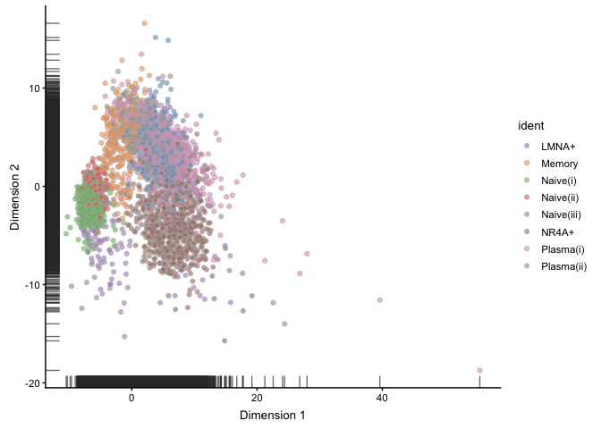
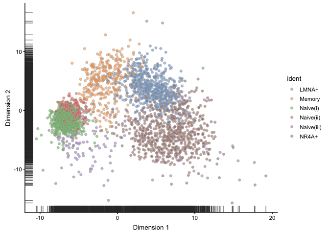

RA Synovial/Blood continuous latent factors
================
Andrew McDavid
2022-02-07

# Libraries

``` r
knitr::opts_chunk$set(echo = TRUE, cache=TRUE, autodep=TRUE, message=FALSE, warning=FALSE)
knitr::opts_chunk$set(dev = c('png', 'pdf'))
library(broom)
library(ggbeeswarm)
library(ggrepel)
library(SingleCellExperiment)
library(scater)
library(slingshot)
library(tidyverse)
library(dplyr)

## Other packages from bioconductor:
# DropletUtils, scran.  Install with BiocInstaller::biocLite(c('DropletUtils', 'scran'))
## Other packages from cran:
# install.packages(c('Seurat', 'readxl'))
```

# Load data

``` r
cdata = read_csv('refined/filtered_clustered_cdata.csv', guess_max = 1e4) %>% mutate(res.0.5 = factor(res.0.5))
fdata = read_csv('refined/filtered_clustered_fdata.csv', guess_max = 5e5) %>% select(-matches('rank|total|mean|bio|tech|p.value|FDR|hvg'))
counts = readRDS('refined/filtered_clustered_exprs.rds')

gene_gradlist = readxl::read_xlsx('refined/curated gene list for gradient analysis 052920.xlsx', col_names = c('symbol', 'X__2', 'comment')) %>% mutate(curated = TRUE) %>% select(-comment, -X__2)
gene_gradlist = gene_gradlist[!duplicated(gene_gradlist$symbol),]
fdata = left_join(fdata, gene_gradlist, by = 'symbol')

sce = SingleCellExperiment(assays = list(counts = counts), rowData = fdata, colData = cdata)
```

# Normalize

``` r
qc = scran::quickCluster(sce, method = 'igraph')
sce = scran::computeSumFactors(sce, cluster = qc)
summary(sizeFactors(sce))
```

    ##    Min. 1st Qu.  Median    Mean 3rd Qu.    Max. 
    ## -1.0452  0.5820  0.8095  0.9854  1.1383 15.2821

``` r
sum(sizeFactors(sce)<0)
```

    ## [1] 46

``` r
qc = qc[sizeFactors(sce)>0]
sce = normalise(sce[,sizeFactors(sce)>0])
sce$IGHDhi = factor(kmeans(logcounts(sce)['IGHD',], centers = c(0, 3))$cluster)
plt = qplot(x = sizeFactors(sce), y = Matrix::colSums(assay(sce, 'counts')), color = factor(qc)) + geom_smooth() 
plt + ylab('Library size (sum)')
```

<!-- -->

``` r
plt + aes(y = Matrix::colSums(assay(sce, 'counts') > 0)) + ylab('CDR')
```

<!-- -->

## Subset clusters

``` r
clusters_use = c('LMNA+', 'Memory', 'NR4A+', 'Naive(i)', 'Naive(ii)')
sce_cd20 = sce[,colData(sce)$ident %in% clusters_use]# & colData(sce)$pop != 'BLD']
```

## HVG

``` r
blacklist = str_detect(rowData(sce_cd20)$symbol, 'IG[HKL]V[0-9]+')
```

``` r
fit.g = scran::trendVar(sce_cd20, subset.row = !blacklist, use.spikes = FALSE, parametric = TRUE)
dec = scran::decomposeVar(sce_cd20, fit.g) %>% as.data.frame() %>% mutate(rank = rank(-bio/total))
ggplot(dec, aes(x = rank, y = p.value)) + geom_point()
```

<!-- -->

``` r
rowData(sce_cd20) = cbind(dec, rowData(sce_cd20))

trendvar_tidy = rowData(sce_cd20) %>% as.data.frame %>% mutate(use = !blacklist, trend = fit.g$trend(mean), cut_mean = cut(sqrt(mean), 5)) %>% group_by(cut_mean, use) %>% mutate(rank_by_mean = rank(-bio/total))

ggplot(dplyr::filter(trendvar_tidy, use), aes(x = sqrt(mean), y = total))+geom_point() + geom_line(aes(y = trend), color = 'red') + ggrepel::geom_text_repel(aes(label = ifelse(rank_by_mean<10 & FDR < .1, symbol, '')), size = 2) + theme_minimal()
```

<!-- -->

``` r
rowData(sce_cd20)$hvg = dec$rank<1000 | !is.na(rowData(sce_cd20)$curated)
```

# PCA

## Selected Seurat clusters

``` r
PCA_COMPONENTS = 2
sce_cd20 = runPCA(sce_cd20, ntop = Inf, ncomponents = PCA_COMPONENTS, scale_features = TRUE, feature_set = rowData(sce_cd20)$hvg)

pca_obj = prcomp(t(logcounts(sce_cd20[rowData(sce_cd20)$hvg,])), rank = 10, center = TRUE, scale. = TRUE)
px = predict(pca_obj, t(logcounts(sce[rowData(sce_cd20)$hvg,])))
reducedDims(sce) = SimpleList(PCA = px)

#sce_cd20 = runDiffusionMap(sce_cd20, ncomponents = 2, ntop = Inf, scale_features = TRUE, feature_set = rowData(sce_cd20)$hvg)

thresh_x = -3
thresh_y = 0
```

``` r
plotPCA(sce_cd20, ncomponents = 2, colour_by = 'ident')
```

<!-- -->

``` r
plotPCA(sce_cd20, ncomponents = 2, colour_by = 'ident') + geom_hline(yintercept = thresh_y, lty = 2) + geom_vline(xintercept = thresh_x, lty = 2)
```

<!-- -->

``` r
plotPCA(sce_cd20, ncomponents = 2, colour_by = 'IGHD', alpha = .3)
```

<!-- -->

``` r
plotPCA(sce_cd20, ncomponents = 2, colour_by = 'IGHDhi')
```

<!-- -->

PCA, Selected groups. PC1 = NR4A+ score, PC2 = memory score?

``` r
plotPCA(sce_cd20, ncomponents = 2, colour_by = 'shm_rate')
```

<!-- -->

``` r
plotPCA(sce_cd20[,!is.na(sce_cd20$shm_rate)], ncomponents = 2, colour_by = 'shm_rate')
```

<!-- -->

SHM, and SHM in cells with a recovered BCR

``` r
plt = plotReducedDim(sce_cd20, use_dimred = 'PCA', ncomponents = 2, colour_by = 'dataset') + geom_point(aes(color = colour_by))

plt + facet_wrap(~colour_by)
```

<!-- -->

``` r
plt = plotReducedDim(sce, use_dimred = 'PCA', ncomponents = 2, colour_by = 'ident') + geom_point(aes(color = colour_by))

plt + facet_wrap(~colour_by)
```

<!-- -->

``` r
var = cumsum(attr(reducedDim(sce_cd20, 'PCA'), 'percentVar'))
qplot(x = seq_along(var), y = var) + geom_line() + scale_x_log10() + ylab('Proportion of variance') + xlab('Index') + theme_minimal()
```

<!-- -->

## All groups

``` r
sce = sce[,!is.na(sce$ident)]
plotPCA(sce, ncomponents = min(PCA_COMPONENTS, 4), colour_by = 'ident')
```

<!-- -->

``` r
plotPCA(sce[,stringr::str_detect(sce$ident, 'Naive|LMNA|NR4A|Memory')], ncomponents = min(PCA_COMPONENTS, 4), colour_by = 'ident')
```

<!-- -->

PCA (All groups)

# Slingshot

``` r
use = 'PCA'
sce_cd20 = slingshot(sce_cd20, clusterLabels = 'ident', reducedDim = use)

# hist(sce_cd20$slingPseudotime_1)

colors <- viridis::plasma(100)
plot(reducedDim(sce_cd20, type = use), col = colors[cut(sce_cd20$slingPseudotime_1,breaks=100)], pch=16, asp = 1)
lines(SlingshotDataSet(sce_cd20), lwd=2)
```

<!-- -->

Slingshot pseudotime places NR4A+ as an endpoint, which doesn’t seem
plausible.

``` r
plot(reducedDim(sce_cd20, type = use), col = sce_cd20$res.0.5 , pch=16, asp = 1)
lines(SlingshotDataSet(sce_cd20), lwd=2)
```

<!-- -->

``` r
pairs(cbind(sce_cd20$slingPseudotime_1, reducedDim(sce_cd20, type = use)[,1:2]), col = sce_cd20$grp)
```

<!-- -->

## PC1 heatmaps

``` r
library(ComplexHeatmap)

sce_cd20plus = sce[, stringr::str_detect(sce$ident, 'Naive|LMNA|NR4A|Memory')]

scater_ident = plotPCA(sce_cd20plus, ncomponents = min(PCA_COMPONENTS, 4), colour_by = 'ident') 


scater_ident_b = ggplot_build(scater_ident)
scater_col = bind_cols(scater_ident$data, scater_ident_b$data[[1]]["fill"]) %>% 
  dplyr::select(fill, ident = colour_by) %>% unique()
scater_col_vec = setNames(scater_col$fill, scater_col$ident)

#prc = sce_cd20[rowData(sce_cd20)$hvg,] %>% assay('logcounts') %>% t %>% prcomp(scale. = TRUE, rank. = 2)

loading = pca_obj$rotation %>% as_tibble(rownames = 'symbol') %>% mutate_at(vars(rank1 = PC1, rank2 = PC2), function(x)  rank(desc(abs(x)))) %>% right_join(rowData(sce_cd20plus) %>% as.data.frame)

rowData(sce_cd20plus) = cbind(rowData(sce_cd20plus), loading[, c('PC1', 'PC2', 'rank1', 
'rank2')])
colData(sce_cd20plus) = cbind(colData(sce_cd20plus), reducedDim(sce_cd20plus)[,1:2])

genes_use = dplyr::filter(loading, rank1 <= 40) %>% arrange(PC1) %>% pull(symbol)

reorder_sce = function(sce_, genes_use, ordering_vector){
  sce_[genes_use, order(ordering_vector) ]
}

sce_cd20_pc1 = reorder_sce(sce_cd20plus, genes_use, sce_cd20plus$PC1)
sce_cd20_pc2 = reorder_sce(sce_cd20plus, dplyr::filter(loading, rank2 <= 40)$symbol,sce_cd20plus$PC2)
sce_cd20_curated = reorder_sce(sce_cd20plus, dplyr::filter(loading, !is.na(curated))$symbol,sce_cd20plus$PC1)


# heatmapf = function(SCE){
# SCE  %>% assay('logcounts') %>% as.matrix %>% Heatmap(cluster_columns = FALSE, clustering_distance_rows = 'pearson', top_annotation = HeatmapAnnotation(colData(SCE)[, c('dataset', 'ident')] %>% setNames(nm = c('dataset', 'Cluster')) , col = list(Cluster = scater_col_vec)), name = 'Normalized Expression')
# }

heatmapf = function(SCE, extra = NULL, barplot_values){
  
  if(missing(barplot_values)){
    top_anno = HeatmapAnnotation(colData(SCE)[, c('ident', extra), drop = FALSE] %>% setNames(nm = c('Cluster', extra)), col = list(Cluster = scater_col_vec))
  } else{
    top_anno = HeatmapAnnotation(colData(SCE)[, c('ident', extra), drop = FALSE] %>% setNames(nm = c('Cluster', extra)), col = list(Cluster = scater_col_vec), barplot = anno_barplot(colData(SCE)[[barplot_values]]))
  }
  
SCE  %>% assay('logcounts') %>% as.matrix %>% Heatmap( name = 'Normalized Expression', cluster_columns = FALSE, cluster_rows = FALSE, top_annotation = top_anno)
}
```

``` r
sce_cd20_pc1 %>% heatmapf(barplot_values = 'PC1')
```

<!-- -->

``` r
sce_cd20_pc1[,sce_cd20_pc1$PC2 < thresh_y & sce_cd20_pc1$ident %in% c('Naive(i)', 'Naive(ii)', 'NR4A+', 'Naive(iii)')] %>% heatmapf(barplot_values = 'PC1')
```

<!-- -->

Top loading genes and PC1

``` r
plotColData(sce_cd20_pc1, x = 'PC1', y = 'shm_rate', colour_by = 'ident') + geom_smooth(method = 'lm', formula = y~splines::ns(x, df = 3)) + ylab('SHM Rate')
```

<!-- -->

``` r
plotExpression(sce_cd20_pc1[,sce_cd20_pc1$PC2<thresh_y & sce_cd20_pc1$ident %in% c('Naive(i)', 'Naive(ii)', 'NR4A+', 'Naive(iii)')], x = 'PC1', features = c('NR4A1', 'DUSP1', 'TXNIP', 'CD79B'), colour_by = 'ident') + geom_smooth(method = 'lm', formula = y~splines::ns(x, df = 3)) + scale_fill_manual(name = NULL, values = scater_col_vec)
```

<!-- -->

Correlation between shm and PC1

## PC2 heatmaps

``` r
sce_cd20_pc2 %>% heatmapf(barplot_values = 'PC2')
```

<!-- -->

``` r
sce_cd20_pc2[,sce_cd20_pc2$PC1 > thresh_x & sce_cd20_pc2$ident %in% c('NR4A+', 'LMNA+', 'Memory', 'Naive(iii)')] %>% heatmapf(barplot_values = 'PC2')
```

<!-- -->

Top loading genes and PC2

``` r
plotColData(sce_cd20_pc2, x = 'PC2', y = 'shm_rate', colour_by = 'ident') + geom_smooth(method = 'lm', formula = y~splines::ns(x, df = 3))  + ylab('SHM Rate')
```

<!-- -->

``` r
plotExpression(sce_cd20_pc2[,sce_cd20_pc2$PC1>thresh_x & sce_cd20_pc2$ident %in% c('NR4A+', 'LMNA+', 'Memory', 'Naive(iii)')], x = 'PC2', features = c('JUN', 'DUSP1', 'S100A6', 'HOPX'), colour_by = 'ident') + geom_smooth(method = 'lm', formula = y~splines::ns(x, df = 3))  + scale_fill_manual(name = NULL, values = scater_col_vec)
```

<!-- -->

``` r
plotExpression(sce_cd20_pc2[,sce_cd20_pc2$PC1>thresh_x], x = 'PC2', features = c('JUN', 'DUSP1', 'S100A6', 'HOPX'), colour_by = 'ident') + geom_smooth(method = 'lm', formula = y~splines::ns(x, df = 3))  + scale_fill_manual(name = NULL, values = scater_col_vec)
```

<!-- -->

Correlation between SHM and PC2

## Curated heatmaps (ordered by PC1)

``` r
sce_cd20_curated %>% heatmapf(extra = 'PC1')
```

<!-- -->

``` r
pc_table = cbind(colData(sce)[, c('sample', 'pop', 'Barcode')], reducedDims(sce)$PCA) %>%
  as.data.frame()
write_csv(pc_table, path = '05slingshot_files/principal_comp.csv')
```
