Clustering BCR
================
Andrew McDavid
2022-01-31

# Load libraries

``` r
knitr::opts_chunk$set(echo = TRUE, message=FALSE, warning=FALSE)
knitr::opts_chunk$set(cache=TRUE, autodep=TRUE)
knitr::opts_chunk$set(dev = c('png', 'pdf'), fig.width = 6, fig.height = 4)
library(broom)
library(tidyverse)
library(ggbeeswarm)

#library(ShortRead)
library(ggdendro)
library(RColorBrewer)
library(CellaRepertorium) # 3257fe9 v0.8.1

ccdb_join = function(template, ccdb, join_fun = dplyr::left_join, by = ccdb$cell_pk){
    if(!inherits(ccdb,  "ContigCellDB")) stop('ccdb must have class CellaRepertorium')

    #join
    if(inherits(template,  "SingleCellExperiment")) {
        #check if all keys ccdb keys are in template
        if(!all(by %in% colnames(SingleCellExperiment::colData(template)))) stop('Not all ccdb keys present in template')
        ccdb$cell_tbl = join_fun(as.data.frame(SingleCellExperiment::colData(template)), ccdb$cell_tbl, by = by)
    }
    else if(inherits(template, "data.frame") || inherits(template, "DataFrame")) {
        #check if all keys ccdb keys are in template
        if(!all(by %in% colnames(template))) stop('Not all ccdb keys present in template')
        ccdb$cell_tbl = join_fun(as.data.frame(template), ccdb$cell_tbl, by = by)
    }
    else stop('Template must inherit from `SingleCellExperiment` or `data.frame`')

    return(ccdb)
}
```

# Filter contigs

``` r
MIN_CDR3_AA = 4
good_bar = read_csv('refined/good_barcodes_combined.csv') %>% mutate(dataset = factor(paste(sample, pop, sep = '_')))
True = 'True'
good_chain = dplyr::filter(good_bar, high_confidence == True, chain != 'Multi', str_length(cdr3) > MIN_CDR3_AA) %>% mutate(cdr3_length = str_length(cdr3_nt)) %>% mutate( fancy_name = fancy_name_contigs(., paste(sample, pop, sep = '_')), dataset = str_c(sample, '_', pop), isotype = str_extract(c_gene, 'IGH[ADGEM]'))
ccdb0 = ContigCellDB_10XVDJ(good_chain, contig_pk = c('sample', 'pop', 'barcode', 'contig_id'), cell_pk = c('dataset', 'sample', 'pop', 'barcode'))
ccdb0$contig_tbl = alakazam::aminoAcidProperties(ccdb0$contig_tbl, seq = 'cdr3')
ccdb0$contig_tbl = ccdb0$contig_tbl %>% group_by(!!!syms(ccdb0$cell_pk)) %>% mutate(any_productive = any(productive == 'True'),
                                                                                  any_nonproductive = any(productive != 'True'))
```

``` r
table(ccdb0$contig_tbl$any_productive, ccdb0$contig_tbl$chain, exclude= NULL)
```

    ##        
    ##          IGH  IGK  IGL
    ##   FALSE   11   26    3
    ##   TRUE  2195 2021  946

``` r
table(ccdb0$contig_tbl$any_nonproductive, ccdb0$contig_tbl$chain, exclude= NULL)
```

    ##        
    ##          IGH  IGK  IGL
    ##   FALSE 1985 1779  844
    ##   TRUE   221  268  105

``` r
scrna_cdata = read_csv('refined/filtered_clustered_cdata.csv', guess_max = 1e4) 
template = scrna_cdata %>% select(dataset, barcode, sample, pop, seqgek_qc_ok, ident, tSNE_1, tSNE_2, contains('NR4A'))
ccdb = ccdb_join(template, ccdb0, join_fun = dplyr::full_join)
ccdb$cell_tbl = ccdb$cell_tbl %>% mutate(ident = fct_explicit_na(ident, na_level = "No5'"), ident_collapse= str_extract(ident, "^[A-Z4a-z+5']+"))
ccdb$contig_tbl = left_join(ccdb$contig_tbl, ccdb$cell_tbl[c(ccdb$cell_pk, 'seqgek_qc_ok', 'ident','ident_collapse', 'tSNE_1', 'tSNE_2', 'NR4A_counts', 'any_NR4A')], by = ccdb$cell_pk)

#ccdb = canonicalize_cell(ccdb, contig_fields = c('ident', 'tSNE_1', 'tSNE_2', 'seqgek_qc_ok', 'productive'))
```

# Good cells

``` r
good_cells = ccdb$cell_tbl
```

# Chain pairings

``` r
paired_chain = enumerate_pairing(ccdb, chain_recode_fun = 'guess') %>% mutate(pairing = ifelse(is.na(pairing), 'none', pairing), 
                                                                              canonical = ifelse(pairing ==  'none', 'none', canonical),
                                                                              chain_type = str_c(pairing,'_', canonical),
                                                                              pairing = factor(pairing, levels = c('none', 'light', 'heavy', 'paired')))
ccdb$cell_tbl = left_join(ccdb$cell_tbl, paired_chain)
```

``` r
paired_table = ccdb$cell_tbl %>% group_by(dataset, canonical, pairing, ident) %>% summarize(ncells = n()) 

ggplot(paired_table, aes(x = dataset, fill = pairing, y = ncells)) + geom_col(position = 'stack') + coord_flip() + theme_minimal()
```

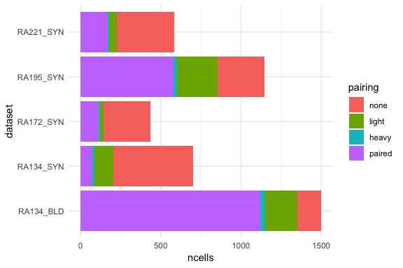<!-- -->

``` r
plt = ggplot(paired_table, aes(x = dataset, fill = pairing, y = ncells)) + geom_col(position = 'stack') + coord_flip() + theme_minimal() + theme(legend.position = 'right') + ylab('Number of barcodes') + facet_wrap(~ident)

plt 
```

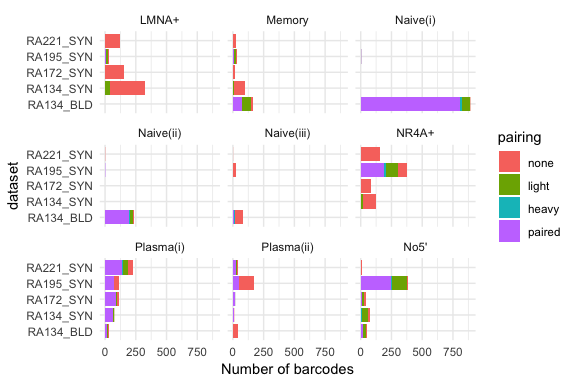<!-- -->

``` r
plt %+% filter(paired_table, ident != "No5'")
```

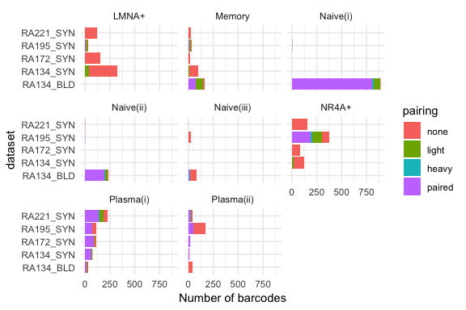<!-- -->
Combinations of contigs recovered per cell.

# Cluster CDR3 DNA

``` r
library(ggrepel)
ccdb$contig_tbl = ungroup(ccdb$contig_tbl)
ccdb = cdhit_ccdb(ccdb, sequence_key = 'cdr3_nt', identity = .97, 
                  min_length = MIN_CDR3_AA*3,G = 1, s=1, cluster_name = 'dna97', showProgress = FALSE)

ccdb = fine_clustering(ccdb, sequence_key = 'cdr3_nt', type = 'DNA', keep_clustering_details = TRUE)

ggplot(ccdb$cluster_tbl %>% filter(n_cluster>1) %>% select(dna97:n_cluster, -fc) %>% gather(key, value, -dna97) , aes(x = value))+ facet_wrap(~key, scales = 'free') + geom_histogram() + scale_y_sqrt()
```

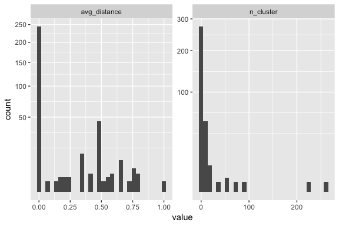<!-- -->

``` r
dendro_plot = function(ccdb, idx, method = 'complete'){
    h = filter(ccdb$cluster_tbl, !!sym(ccdb$cluster_pk) == idx) %>% pull(fc) %>% .[[1]]
    quer = filter(ccdb$contig_tbl, !!sym(ccdb$cluster_pk) == idx) %>% ungroup()
    hc = hclust(as.dist(h$distance_mat), method = method) %>% dendro_data(type = "rectangle")
    hc$labels = cbind(hc$labels, quer)
   ggplot(hc$segments, aes(x=x, y=y)) + geom_segment(aes(xend=xend, yend=yend)) + 
  theme_classic() + geom_text_repel(data = hc$labels, aes(color = sample, label = class), size = 3, box.padding = 0) + scale_x_continuous(breaks = NULL) + ylab('AA Distance') + xlab('')
}


to_plot = filter(ccdb$cluster_tbl, n_cluster > 50)
map(to_plot$dna97, ~ dendro_plot(ccdb, .) + ylab("DNA Distance"))
```

    ## [[1]]

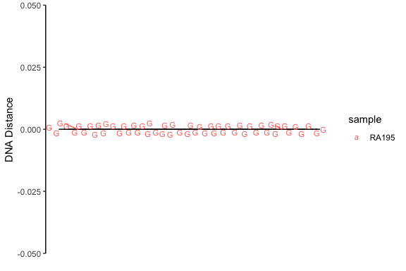<!-- -->

    ## 
    ## [[2]]

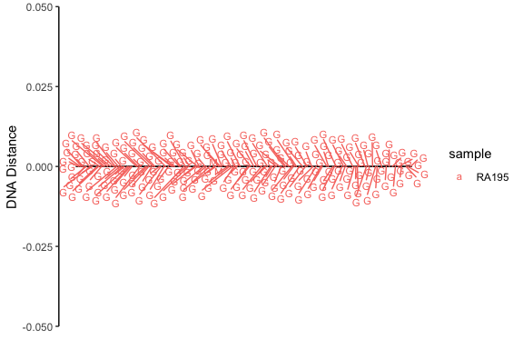<!-- -->

    ## 
    ## [[3]]

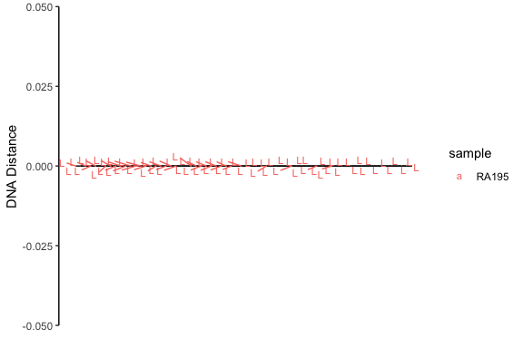<!-- -->

    ## 
    ## [[4]]

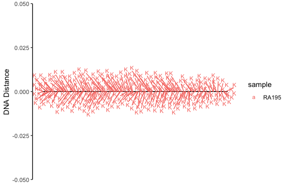<!-- -->

    ## 
    ## [[5]]

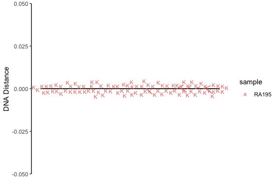<!-- -->

``` r
# write_csv(good_cluster, 'refined/good_barcodes_clustered.csv')
# 
# cluster_id = good_cluster %>% group_by(cluster_idx) %>% summarize(cdr3_representative = get_canonical_representative(cdr3, warn_if_distinct = TRUE))
```

We cluster the CDR3 DNA with
[CD-HIT](http://weizhongli-lab.org/cdhit_suite/cgi-bin/index.cgi?cmd=cd-hit).
A sequence is included in a cluster if it matches by 100% similiarity
and has the same CDR3 length.

``` r
ccdb$contig_tbl = ungroup(ccdb$contig_tbl)
ccdb$contig_tbl$has_class = !is.na(ccdb$contig_tbl$class)
ccdb = canonicalize_cluster(ccdb, contig_filter_args = TRUE, contig_fields = c('cdr3', 'cdr3_nt', 'chain', 'v_gene', 'd_gene', 'j_gene', 'class', 'shm', 'umis', 'has_class', 'is_medoid'), tie_break_keys = c('has_class', 'is_medoid', 'umis'), representative = 'cdr3')
```

``` r
class_colors = data_frame(class =  unique(ccdb$cluster_tbl$class)) %>% mutate(class_color =  brewer.pal(length(class),"Set1"))

#key = ggplot(class_colors %>% mutate(y = factor(0),  class_fct = factor(class) %>% fct_explicit_na()), aes(x = class_fct, y = y, color = class_fct)) + geom_point() + scale_color_manual(name = "class",values = class_colors$class_color, labels = class_colors$class)


feature_tbl = ccdb$cluster_tbl %>% left_join(class_colors) %>% select(-fc)

ccdb$cluster_pk = 'representative'
pairing_list = pairing_tables(ccdb, table_order = 2, orphan_level = 1, canonicalize_fun = canonicalize_by_chain) 


pairs_plt = ggplot(pairing_list$cell_tbl, aes(x = cluster_idx.1_fct, y = cluster_idx.2_fct, color = sample, shape = pop)) + geom_jitter(width = .4, height = .4) + theme_minimal()

ylab = data_frame(representative =  ggplot_build(pairs_plt)$layout$panel_params[[1]]$y.label) %>% left_join(feature_tbl) %>% mutate(class_color = ifelse(is.na(class_color), '#E41A1C', class_color))

xlab = data_frame(representative =  ggplot_build(pairs_plt)$layout$panel_params[[1]]$x.label) %>% left_join(feature_tbl) %>% mutate(class_color = ifelse(is.na(class_color), '#E41A1C', class_color))

pairs_plt = pairs_plt + theme(axis.text.x = element_text(angle = 90, color = xlab$class_color, size = 8), axis.text.y = element_text(color = ylab$class_color, size = 8))

pairs_plt
```

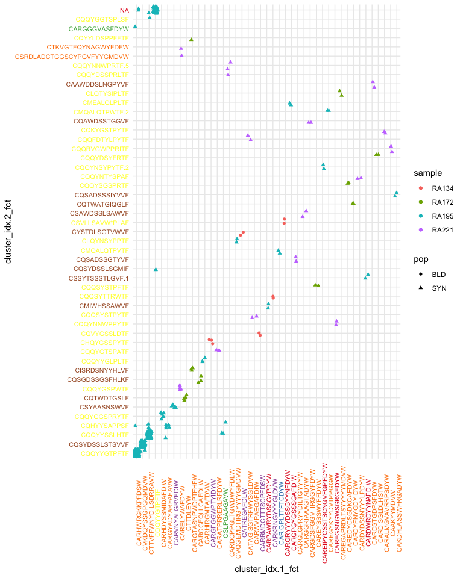<!-- -->

``` r
plot.new()
legend(x = c(0, 1), y = c(0, 1), legend = class_colors$class, fill = class_colors$class_color)
```

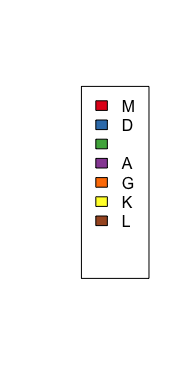<!-- -->

# RA195

``` r
white_list_195 = filter_cdb(ccdb, sample == 'RA195')$contig_tbl %>% group_by(representative) %>% summarize(n()) %>% filter(`n()`>1) %>% select(cluster_idx.1 = representative)

pairing_list_195 = pairing_tables(filter_cdb(ccdb, sample == 'RA195'), table_order = 2, orphan_level = 1,  canonicalize_fun = canonicalize_by_chain, cluster_keys = 'class', cluster_whitelist = white_list_195)

cell_tbl_195 = pairing_list_195$cell_tbl %>% group_by(cluster_idx.1, cluster_idx.2, ident) %>% mutate(cell_clone_seq = seq_along(barcode)) %>% filter(cell_clone_seq < 20, !is.na(cluster_idx.2))

pairs_plt = (pairs_plt %+% filter(cell_tbl_195)) + aes(color = ident)

ylab = data_frame(representative =  ggplot_build(pairs_plt)$layout$panel_params[[1]]$y.label) %>% left_join(feature_tbl) %>% mutate(class_color = ifelse(is.na(class_color), '#E41A1C', class_color))

xlab = data_frame(representative =  ggplot_build(pairs_plt)$layout$panel_params[[1]]$x.label) %>% left_join(feature_tbl) %>% mutate(class_color = ifelse(is.na(class_color), '#E41A1C', class_color))

pairs_plt = pairs_plt + theme(axis.text.x = element_text(angle = 90, color = xlab$class_color, size = 8), axis.text.y = element_text(color = ylab$class_color, size = 8)) + xlab("Heavy (if available)")+ ylab("Light")

pairs_plt
```

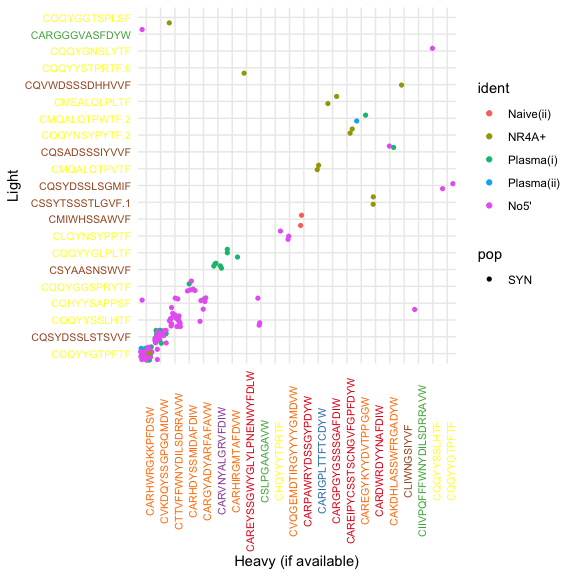<!-- -->

``` r
pairs_plt + aes(color = ident_collapse)
```

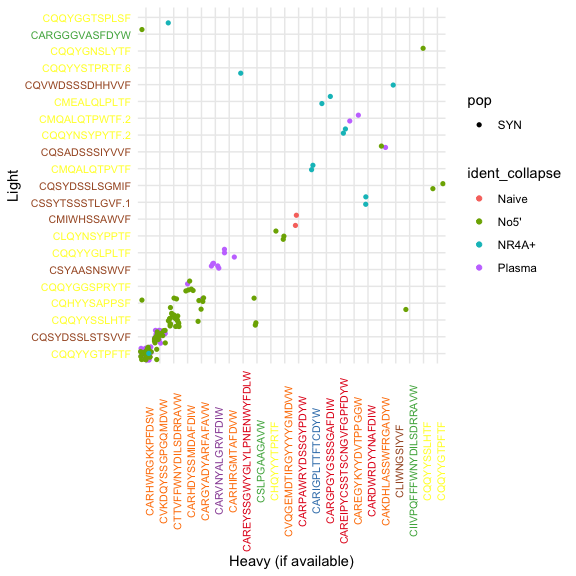<!-- -->

# Distribution of CDR3 types by subpopulation

``` r
fields = dplyr::select(ccdb$contig_tbl, dna97, is_medoid, `d(medoid)`, umis, class, starts_with('cdr3_AA_'), shm, cdr3_nt) %>% names()

by_chain = split_cdb(ccdb, 'ig_heavy') %>% map(canonicalize_cell, contig_fields = fields) %>%
  map_dfr('cell_tbl', .id = 'ig_heavy') %>% left_join(ccdb$cluster_tbl %>% select(dna97, representative, n_cluster, avg_distance)) %>% 
  group_by(dna97, sample) %>% mutate(n_ident = length(unique(ident_collapse))) %>% ungroup() %>% mutate(ident_collapse = fct_relevel(ident_collapse, "No5'"),
                                                                                                        dataset = factor(dataset))

expanded_clones_nobld = by_chain %>% filter(pop != 'BLD')  %>% group_by(dna97, ig_heavy, n_ident_gt_1 = n_ident > 1) %>% summarize(n_occur = n()) %>% group_by(ig_heavy) %>% mutate(rank_n_occur = min_rank(-n_occur))

expanded_clones = by_chain %>%group_by(dna97, ig_heavy, n_ident_gt_1 = n_ident > 1) %>% summarize(n_occur = n()) %>% group_by(ig_heavy) %>% mutate(rank_n_occur = min_rank(-n_occur))

by_chain_count = by_chain %>% group_by(representative, dna97, dataset, ident_collapse) %>% summarize(n_per_ident = n(), n_ident = n_ident[1]) %>% 
  ungroup() %>% mutate(c_n_per = cut(n_per_ident, c(-1, 0, 1, 2, 5, 10, 20, 50, 100, 200, 400)))

ggplot(filter(by_chain_count, n_ident > 1), aes(x = representative, y = c_n_per)) + geom_col() + facet_grid(~ident_collapse, scales = 'free') + coord_flip()
```

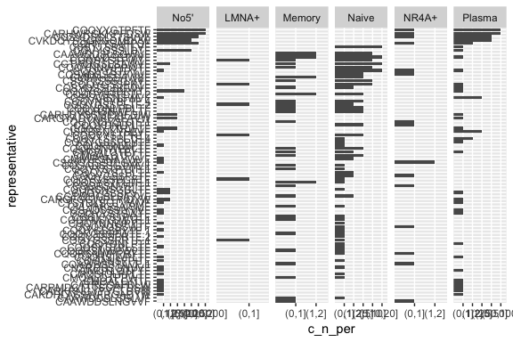<!-- -->

``` r
chain_plot = ggplot(filter(by_chain, n_cluster > 1, n_ident > 1, ig_heavy == 'TRUE') , aes(x = representative, fill = dataset)) + geom_bar() + facet_grid(~ident_collapse) + coord_flip()  + theme_minimal() + scale_fill_discrete(drop = FALSE) + theme(axis.text.y = element_text(size = 6.5))

chain_plot %+% (semi_join(by_chain, filter(expanded_clones_nobld, ig_heavy == 'TRUE' &  n_ident_gt_1))) + ggtitle('Heavy chain CDR3')
```

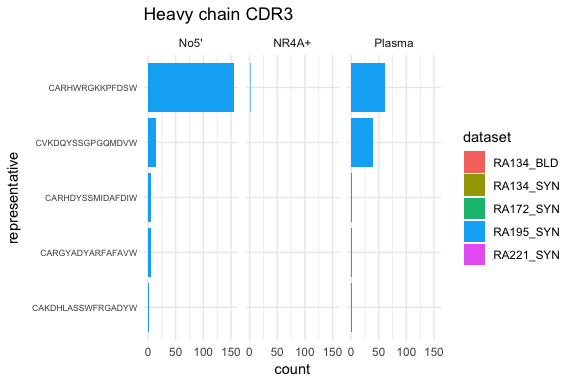<!-- -->

``` r
chain_plot %+% (semi_join(by_chain, filter(expanded_clones_nobld, ig_heavy == 'FALSE' &  n_ident_gt_1)))  + ggtitle('Light chain CDR3')
```

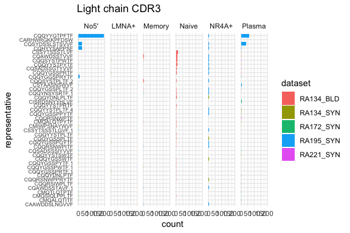<!-- -->

CDR3 clones seen in &gt; 1 population in at least one non-blood sample.

``` r
write_csv(filter(by_chain, n_cluster > 1) %>% arrange(desc(n_cluster)) %>% select(cdr_cluster_id = dna97, ig_heavy, n_cluster, n_ident, avg_intracluster_edit_distance = avg_distance, is_medoid:tSNE_2, IGH_umis = IGH, IGK_umis = IGK, IGL_umis = IGL, raw_chain_type:chain_type), 'refined/expanded_clones2.csv')

filter(by_chain, ig_heavy==TRUE, n_cluster > 1) %>% group_by(dataset == 'RA134_BLD') %>% summarize(n_distinct(dna97))
```

    ## # A tibble: 2 x 2
    ##   `dataset == "RA134_BLD"` `n_distinct(dna97)`
    ##   <lgl>                                  <int>
    ## 1 FALSE                                     43
    ## 2 TRUE                                       5

``` r
cluster_crosstab = with(filter(by_chain, n_cluster > 1, ig_heavy==TRUE) %>% mutate(dna97 = fct_reorder(as.factor(dna97), n_cluster, .desc = TRUE)), table(dna97, ident)) %>% rbind() %>% as_tibble(rownames = 'cdr_cluster_id')
write_csv(cluster_crosstab, 'refined/clone_crosstab.csv')

chain_plot %+% (semi_join(filter(by_chain, !(ident_collapse %in% c("No5'", 'Naive'))), filter(expanded_clones, ig_heavy == 'TRUE' &  n_occur > 1))) + ggtitle('Heavy chain CDR3') + facet_grid(~ident_collapse, space = 'free', scales = 'free')
```

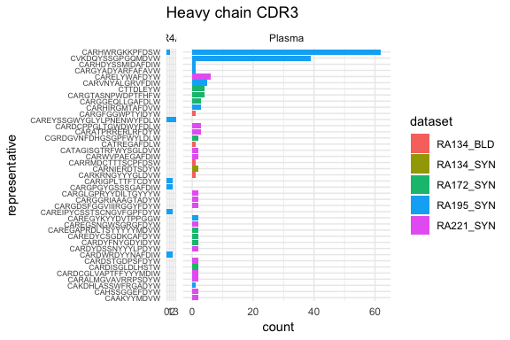<!-- -->

``` r
chain_plot %+% (semi_join(filter(by_chain,  ident_collapse != "No5'"), filter(expanded_clones, ig_heavy == 'FALSE' &  rank_n_occur < 21)))  + ggtitle('Light chain CDR3')
```

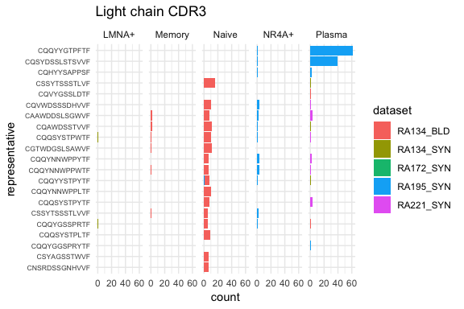<!-- -->

Most prevalent CDR3 overall

## Permutation test for homogeneity of cluster

``` r
tmp = filter_cdb(ccdb, ident != "No5'")
by_chain_ccdb = split_cdb(tmp, 'ig_heavy') %>% map(canonicalize_cell, contig_fields = fields)

.as.vector.tibble = function(x){
  if(inherits(x, 'data.frame')){
  if(ncol(x)>1) stop('Only supported for one column df')
    x[[1]]
  } else{
    as.vector(x)
  }
}

purity2 = function(cluster_idx, subject) {
    cluster_idx = .as.vector.tibble(cluster_idx)
    subject = .as.vector.tibble(subject)
    n_label_cluster = dplyr::tibble(cluster_idx = cluster_idx, subject = subject) %>%
        group_by(cluster_idx) %>% summarize(n = dplyr::n_distinct(subject)) %>% ungroup()
    #Average number of singleton clusters for each subject
    n_dispersed = sum(n_label_cluster$n>1)
    n_dispersed
}
test = cluster_permute_test(by_chain_ccdb$`TRUE`, 'ident_collapse', 'dna97', statistic = purity2, n_perm = 1000)
test
```

    ## $observed
    ## [1] 1
    ## 
    ## $expected
    ## [1] 24.205
    ## 
    ## $p.value
    ## [1] 0.001
    ## 
    ## $mc.se
    ## [1] 0.08466489

``` r
cluster_count = function(cluster_idx, group){
   cluster_idx = .as.vector.tibble(cluster_idx)
    group = .as.vector.tibble(group)
    #n_label_cluster = dplyr::tibble(cluster_idx = cluster_idx, group = group)
    tab = table(cluster_idx, group)
    # only count non-zero clones
    tab[tab==0] = NA
    avg_clonality = colMeans(tab, na.rm = TRUE)
    avg_clonality['NR4A-']-avg_clonality['NR4A+']
}

plasma_counts = by_chain_ccdb$`TRUE` %>% filter_cdb(ident_collapse == 'Plasma', tbl = 'cell_tbl') %>% equalize_ccdb()
nr4a_test = plasma_counts %>% cluster_permute_test('any_NR4A', 'dna97', statistic = cluster_count, n_perm = 1000)
```

``` r
nr4a_test
```

    ## $observed
    ##     NR4A- 
    ## 0.2577627 
    ## 
    ## $expected
    ## [1] -0.03170419
    ## 
    ## $p.value
    ## [1] 0.001
    ## 
    ## $mc.se
    ## [1] 0.002204133

``` r
plasma_counts$cell_tbl %>% 
  ungroup() %>% 
  count(any_NR4A, dna97) %>% 
  group_by(any_NR4A) %>%
  summarize(mean(n))
```

    ## # A tibble: 2 x 2
    ##   any_NR4A `mean(n)`
    ##   <chr>        <dbl>
    ## 1 NR4A-         1.51
    ## 2 NR4A+         1.25

``` r
ggplot(plasma_counts$cell_tbl, aes(x = any_NR4A, y = shm)) + geom_boxplot() + theme_minimal()
```

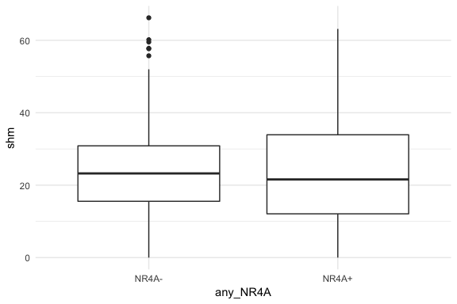<!-- -->

``` r
ggplot(plasma_counts$cell_tbl, aes(x = NR4A_counts, y = shm)) + geom_point() + geom_smooth(method = 'lm') + theme_minimal()
```

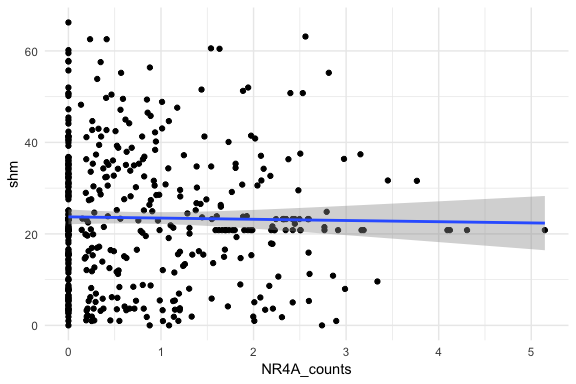<!-- -->

``` r
clonal_freq_cell = plasma_counts$cell_tbl %>% 
  group_by(dna97, any_NR4A) %>% 
  mutate(count = n()) %>%
  group_by(any_NR4A) %>%
  mutate(inv_freq = count/n(), cut_freq = cut(inv_freq, breaks = c(0, .05, .1, .15, .2, .25, .3))) %>%
  count(any_NR4A, cut_freq) %>% 
  group_by(any_NR4A) %>%
  mutate(prop = n/sum(n))
  

ggplot(clonal_freq_cell, aes(x = cut_freq, fill = any_NR4A, y = prop)) + 
  geom_col(position = 'dodge') +
  theme_minimal() +
  scale_fill_discrete('NR4A expression') +
  labs(x = 'Clonal frequency of cell', y = 'Proportion of cells') +
  theme(legend.pos = 'bottom')
```

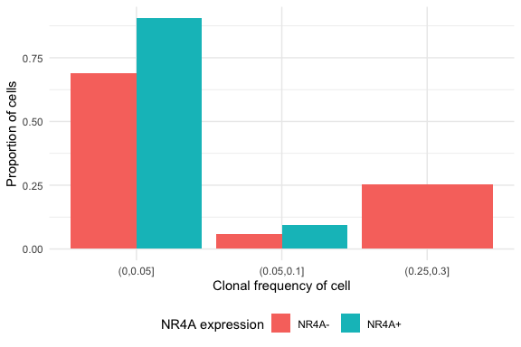<!-- -->

# TSNE, again?

``` r
ccdb2 = ccdb
ccdb2$contig_tbl = left_join(ccdb$contig_tbl, ccdb$cluster_tbl %>% select(dna97, n_cluster))
heavy_maybe = canonicalize_cell(ccdb2, contig_filter_args = ig_heavy == 'TRUE', tie_break_keys = c('n_cluster'), contig_fields = c('ig_heavy', 'n_cluster', 'dna97'))

heavy_maybe = heavy_maybe$cell_tbl  %>% mutate(clone_class = case_when(dna97 == 1668 ~ 'CARHWRGKKPFDSW', n_cluster > 1 ~ 'Expanded', !is.na(dna97) ~ 'Recovered', TRUE ~ 'None'), clone_class = factor(clone_class, levels = c('None', 'Recovered', 'Expanded', 'CARHWRGKKPFDSW'))) %>% arrange(clone_class)

ggplot(heavy_maybe, aes(x = tSNE_1, y = tSNE_2, color = clone_class)) + geom_point() + theme_minimal() + scale_color_manual('BCR', values = c('grey', 'black', 'blue', 'red'))
```

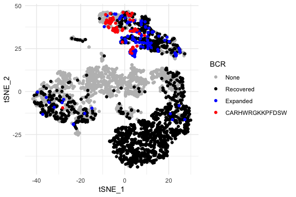<!-- -->

# AA properties of CDR3

``` r
props = by_chain %>% select(ig_heavy, dataset, barcode, ident_collapse, starts_with("cdr3_AA")) %>% tidyr::gather('cdr_prop','value', starts_with('cdr3_AA')) %>%
  mutate(ident_collapse = fct_relevel(ident_collapse, 'Naive'))

aa_props_plt = ggplot(filter(props, ig_heavy == 'TRUE'), aes(x = value)) + geom_histogram() + facet_grid(ident_collapse ~ cdr_prop, scales = 'free') + theme_minimal()

aa_props_plt + ggtitle('Heavy chain')
```

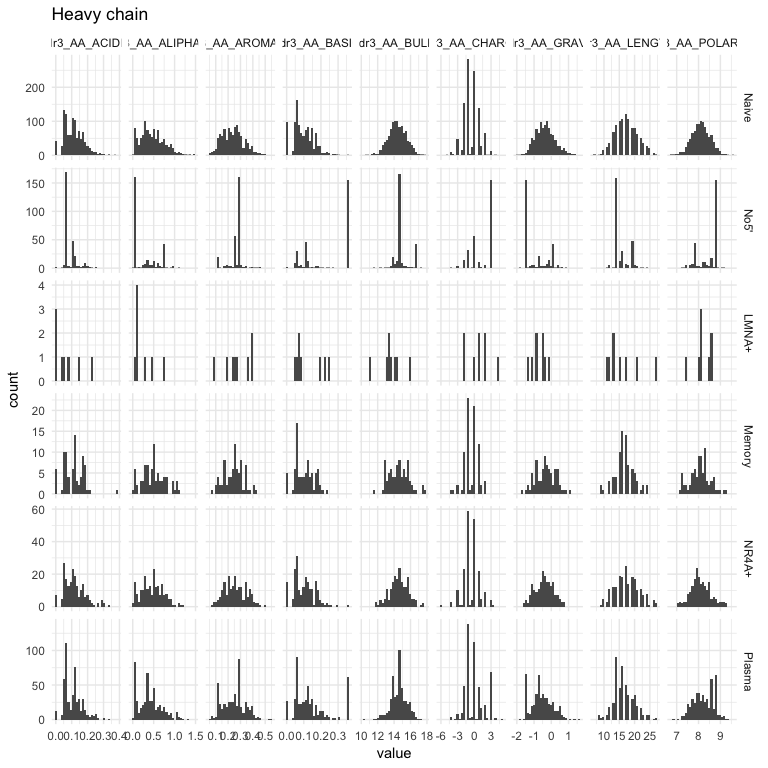<!-- -->

``` r
aa_props_plt %+% filter(props, ig_heavy == 'FALSE') + ggtitle('Light chain')
```

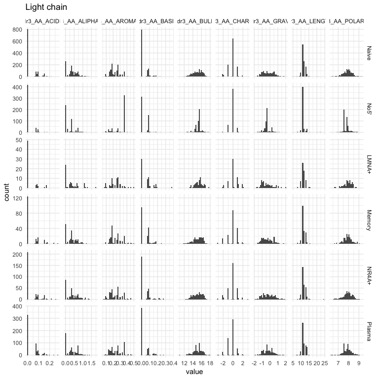<!-- -->

``` r
foo = props %>% group_by(cdr_prop, ig_heavy) %>% do({
  ll = lme4::lmer(value ~ ident_collapse + (1|dataset), data = .)
  tidy(ll)
})

filter(foo, str_detect(term,'ident_collapse')) %>% mutate(ident = gsub("ident_collapse", "", term)) %>% ggplot(aes(x = ident, y = estimate, ymin = estimate - std.error*1.96, ymax = estimate + std.error*1.96, color = ig_heavy)) + geom_pointrange(position = position_dodge(width = .3)) + facet_wrap(~cdr_prop, scale = 'free_y') + theme_minimal() + geom_hline(yintercept = 0, lty = 2) + theme(axis.text.x = element_text(angle = 90))
```

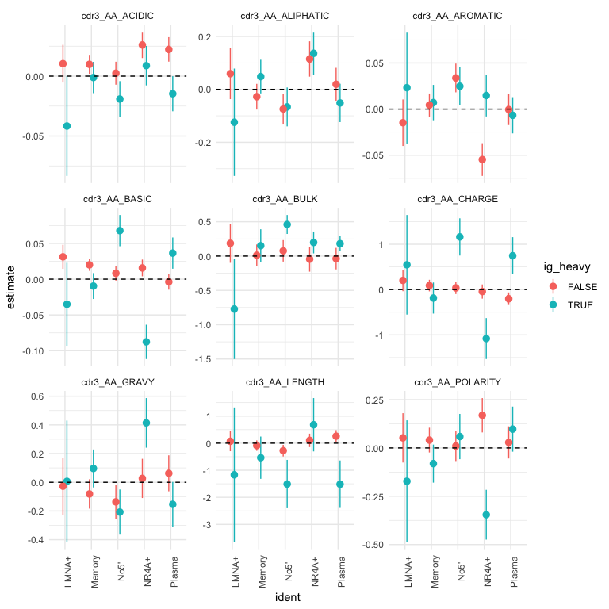<!-- -->

Top 10, any sample

# UMIs/class by subpopulation

``` r
cell_tbl = ccdb$cell_tbl
by_chain2 = left_join_warn(cell_tbl[ccdb$cell_pk], ungroup(by_chain)[c(setdiff(names(by_chain), names(cell_tbl)), ccdb$cell_pk)], by = ccdb$cell_pk) 
by_chain3 = by_chain2 %>%
  complete(nesting(!!!syms(ccdb$cell_pk)), ig_heavy, fill = list(umis = 0, n_cluster = 0, n_ident = 0)) %>% filter(!is.na(ig_heavy))
by_chain4 =  left_join_warn(cell_tbl, by_chain3[c(setdiff(names(by_chain3), names(cell_tbl)), ccdb$cell_pk)], by = ccdb$cell_pk)


class_plot =  ggplot(filter(by_chain4, ig_heavy == 'TRUE'), aes(x = ident, fill = class)) + geom_bar() + theme_minimal()
class_plot
```

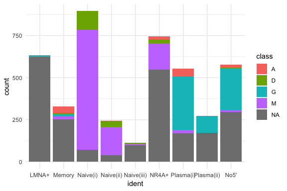<!-- -->

``` r
class_plot %+% filter(by_chain4, ig_heavy == 'FALSE')
```

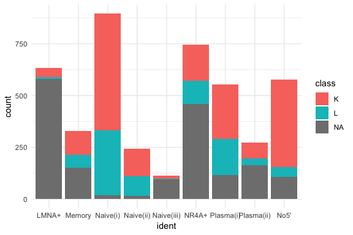<!-- -->

``` r
ggplot(filter(by_chain4, ig_heavy == 'TRUE'), aes(x = ident, y = umis)) + geom_quasirandom() + scale_y_continuous(trans = 'log1p') + coord_cartesian(ylim = c(0, 6000)) + theme_minimal() + ggtitle('Heavy chain UMIs')
```

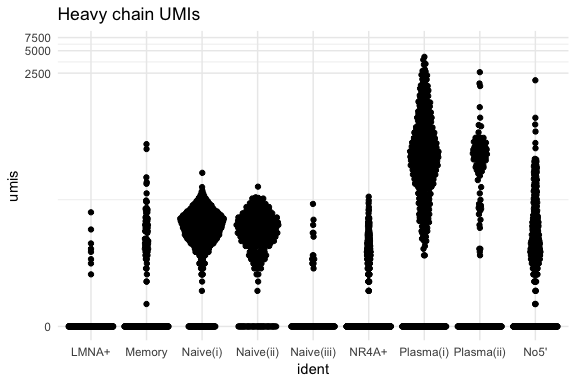<!-- -->

``` r
ggplot(filter(by_chain4, ig_heavy == 'TRUE'), aes(x = forcats::fct_reorder(ident, umis), y = log1p(umis))) +
  geom_boxplot() + 
  theme_minimal() + 
  ggtitle('Heavy chain UMIs') + 
  stat_summary(data = filter(by_chain4, ig_heavy == 'TRUE', umis>0), color = 'blue', position = position_dodge(width = .3)) +
  theme(axis.text.x = element_text(angle = 90))
```

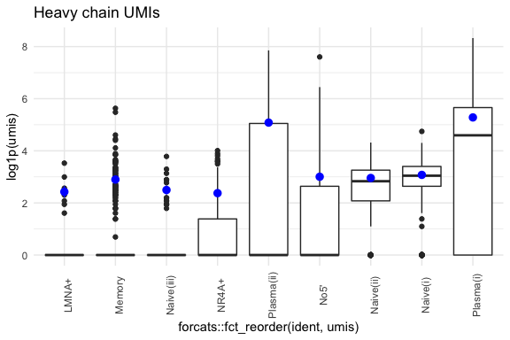<!-- -->

``` r
summary(lme4::lmer(umis ~ ident + (1|dataset), data = filter(by_chain4, ig_heavy == 'TRUE', umis>0, ident_collapse == 'Plasma'), family = gaussian(link = 'log')))
```

    ## Generalized linear mixed model fit by maximum likelihood (Laplace
    ##   Approximation) [glmerMod]
    ##  Family: gaussian  ( log )
    ## Formula: umis ~ ident + (1 | dataset)
    ##    Data: 
    ## filter(by_chain4, ig_heavy == "TRUE", umis > 0, ident_collapse ==  
    ##     "Plasma")
    ## Control: 
    ## structure(list(optimizer = c("bobyqa", "Nelder_Mead"), calc.derivs = TRUE,  
    ##     use.last.params = FALSE, restart_edge = FALSE, boundary.tol = 1e-05,  
    ##     tolPwrss = 1e-07, compDev = TRUE, nAGQ0initStep = TRUE, checkControl = list( 
    ##         check.nobs.vs.rankZ = "ignore", check.nobs.vs.nlev = "stop",  
    ##         check.nlev.gtreq.5 = "ignore", check.nlev.gtr.1 = "stop",  
    ##         check.nobs.vs.nRE = "stop", check.rankX = "message+drop.cols",  
    ##         check.scaleX = "warning", check.formula.LHS = "stop",  
    ##         check.response.not.const = "stop"), checkConv = list( 
    ##         check.conv.grad = list(action = "warning", tol = 0.001,  
    ##             relTol = NULL), check.conv.singular = list(action = "ignore",  
    ##             tol = 1e-04), check.conv.hess = list(action = "warning",  
    ##             tol = 1e-06)), optCtrl = list()), class = c("glmerControl",  
    ## "merControl"))
    ## 
    ##      AIC      BIC   logLik deviance df.resid 
    ##   7367.3   7384.1  -3679.7   7359.3      481 
    ## 
    ## Scaled residuals: 
    ##     Min      1Q  Median      3Q     Max 
    ## -3.6706 -0.3401 -0.1155  0.1853  5.7573 
    ## 
    ## Random effects:
    ##  Groups   Name        Variance Std.Dev.
    ##  dataset  (Intercept) 133762   365.7   
    ##  Residual             189952   435.8   
    ## Number of obs: 485, groups:  dataset, 5
    ## 
    ## Fixed effects:
    ##                 Estimate Std. Error t value Pr(>|z|)    
    ## (Intercept)       6.1554     0.3754  16.396  < 2e-16 ***
    ## identPlasma(ii)  -0.5216     0.1729  -3.017  0.00255 ** 
    ## ---
    ## Signif. codes:  0 '***' 0.001 '**' 0.01 '*' 0.05 '.' 0.1 ' ' 1
    ## 
    ## Correlation of Fixed Effects:
    ##             (Intr)
    ## identPlsm() -0.027

Heavy chain UMIs in plasma clusters. About \`r round(exp())
